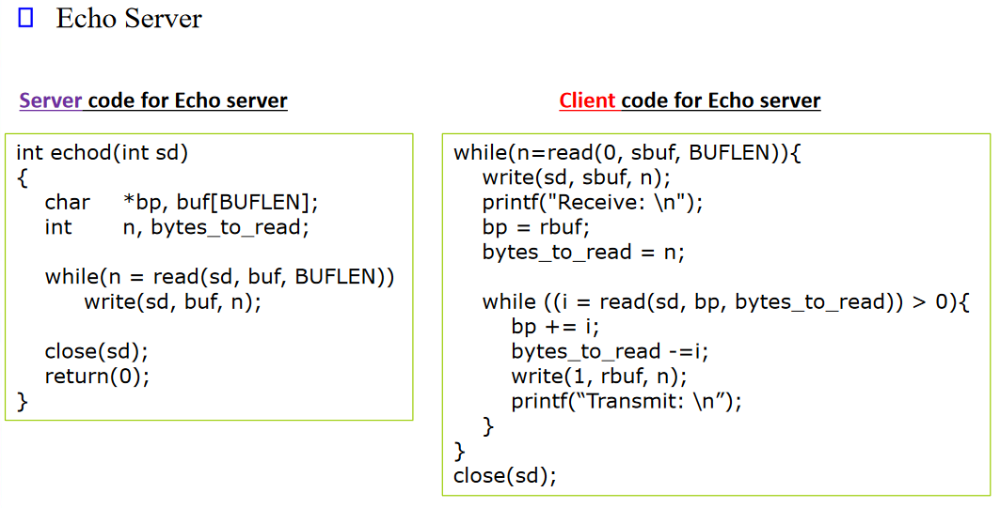

# Computer Networks (SOFE3850)

Todo: Upload images

## <ins>Office hours</ins>:
- Tues. 6-7 pm
- Thurs. 2-3 pm

## <ins>Tutorials</ins>:
- Mondays 2:10 - 3:30
- **Wednesdays 5:10 - 6:30**

## <ins>Labs</ins>:
| CRN  | Location | Times        | Days                              | TA                |
|------|----------|--------------|-----------------------------------|-------------------|
|74018 | ERC3052  | Fri 5-8 pm   | 19/1, 2/2, 16/2, 8/3, 22/3, 5/4   | Md Maruf          |
|74019 | ERC3052  | Tue 2-5 pm   | 16/1, 30/1, 13/2, 05/3, 19/3, 2/4 | Shawon Ashadullah |
|74020 | ERC3052  | Tue 2-5 pm   | 9/1, 23/1, 6/2, 27/2, 12/3, 26/3  | Shawon Ashadullah |
|74021 | ERC3052  | Thr 11am-2pm | 18/1, 1/2, 15/2, 7/3, 21/3, 4/4   | Amin Avan         |
|74283 | ERC3052  | Thr 11am-2pm | 11/1, 25/1, 8/2, 29/2, 14/3, 28/3 | Amin Avan         |

**Quizzes:**
- Lockdown browser will be used in quizzes and must be done in class.
- Expect a quiz every week. *(I will drop the lowest quiz mark)*

| Category                     | Mark   |
|------------------------------|--------|
| In-Class Activities/Quizzes  | 10%    |
| Labs                         | 15%    |
| Project                      | 15%    |
| Midterm (Feb. 26th)          | 20%    |
| Final                        | 40%    |

**Project:**
TBD

**Midterm:**
- The exam will be on Feb. 15th during the class time.
- No midterm deferral, marks will be added to the final exam
- Must pass final.

## <ins>Course Overview</ins>

Network history and architectures; reference Model for Open Systems Interconnection (OSI): descriptions, examples, and applications; bridges, routers, gateways; routing, multicast deliver; TCP/IP protocol suite; network topologies (ring, bus, tree, star, mesh); local area networks, Ethernet, Token passing, wireless LAN, personal LAN, WAN

---

<details>
  <summary style="font-size: 30px; font-weight: 500; cursor: pointer;">Lecture 5 | LAN</summary>


  # Overview
- Introduction
- Ethernet – CSMA/CD
- Ethernet Switching
- Virtual LAN (VLAN)
- Wireless LAN (WiFi)

# The MAC (Medium Access Control) Sublayer
Two typees of links:

- Point-to-Point:
  - PPP for dial-up access
  - Point-to-point link between Ethernet switch and a host
- Broadcast
  - Old-fashioned Ethernet
  - Cable network
  - 802.11 wireless LAN

## The MAC Sublayer
- Responsible for deciding who sends next on a multi-access link
- An important part of the link layer, especially for LANs


</details>

---

<details>
  <summary style="font-size: 30px; font-weight: 500; cursor: pointer;">Lecture 6 | TBD</summary>

## Layer Architecture
- Networking requires the co-operation of many different tasks
- Raw data transfer over a physical channel
- Error and flow control
- Switching
- Routing
- Traffic control
- Network Security

# Protocol Layers
Protocol layering is the main structuring method used to divide up network functionality.
- Each protocol instance talks virtually to its peer
- Each layer communicates only by using the one below
- Lower layer services are accessed by an interface
- At bottom, messages are carried by the medium
- Each protocol at different layers serves a different purpose
- Each lower layer adds its own header (with control information) to the message to transmit and removes it on receive
- Layers may also split and join messages, etc.


# Design Issues for the Layers

Each layer solves a particular problem but must include mechanisms to address a set of recurring design issues.
| Issue | Example mechanisms at different layers |
|-|-|
| Reliability | despite failures Codes for error detection/correction (Ch 3.2, 3.3), Routing around failures (Ch 5.2) |
| Network growth and evolution | Addressing (Ch 5.6) and naming (Ch 7.1), Protocol layering (Ch 1.3) |
| Allocation of resources like bandwidth | Multiple access (Ch 4.2), Congestion control (Ch 5.3, 6.3) |
| Security against various threats | Confidentiality of messages (Ch 8.2, 8.6), Authentication of communicating parties (Ch 8.7) |


# Connection-oriented vs. connectionless service

Layers can offer two types of service to the layers above them:
- **Connection-oriented**: a connection must be set up for ongoing use (and torn down after use), e.g., phone call. A connection should be established before sending data and every packet should be acknowledged
- **Connectionless**: messages are handled separately, e.g., postal delivery (each message (letter) carries the full destination address and routed independently)

Each kind of service can further be characterized by its reliability. Reliability in this context means the message is acknowledged. (i.e. whether or not a service receives a data packet)


# Service Primitives

- A service is provided to the layer above as primitives (operations). If the protocol stack is located in the _operating system,_ the primitives are normally **system calls.**
  - These calls cause a trap to kernel mode, which then turns control of the machine over to the operating system to send the necessary packets.
 
A hypothetical example of service primitives that may provide a reliable byte stream (connection-oriented) service:

| Primitive | Meaning |
|-|-|
| LISTEN | Block waiting for an incoming connection |
| CONNECT | Establish connection with a waiting peer |
| ACCEPT | Accept an incoming connection from a peer |
| RECEIVE | Block waiting for an incoming message |
| SEND | Send a message to the peer |
| DISCONNECT | Terminate a connection |


# Relationship of Services to Primitives

A service is a set of primitives (operations) that a layer provides to the layer
above it:
- A layer provides a _service_ to the one above it [**vertical**]

A protocol, in contrast, is a set of rules governing the format and meaning of the packets, or messages that are exchanged by the peer entities within a layer.
- A layer talks to its peer using a _protocol_ [**horizontal**]


## Reference Models

Reference models describe the layers in a network architecture
- **OSI** (Open Systems Interconnection) reference model (Developed by the International Standard Organization (ISO))
- **TCP/IP** reference model
- Model used for this text
- Critique of OSI and TCP/IP

# OSI Reference Model

A principled, international standard, seven layer model to connect different systems

| Layer | Name | Protocol |
|-|-|-|
| 7 | Application | Provides functions needed by users |
| 6 | Presentation | Converts different representations |
| 5 | Session | Manages task dialogs |
| 4 | Transport | Provides end-to-end delivery |
| 3 | Network | Sends packets over multiple links |
| 2 | Data Link | Sends frames of information |
| 1 | Physical | Sends bits as signals over the channel |

### Physical Layer:
- bits “on the wire”.
- Determines the specs for all physical components
  - Cabling: Twisted Pair, Fiber Optic, Coax Cable
  - Interconnect methods (topology / devices)
  - Data encoding (bits to signals)
  - Electrical properties

Examples:
- Ethernet (IEEE 802.3)
- Token Ring (IEEE 802.5)
- Wireless (IEEE 802.11n, ac)


What are the Physical Layer components on computer?
- NIC: Network Interface Card
- It has a MAC Address/Physical address of a computer

---

### Link Layer:
- Data transfer between neighboring network elements
  - Moving frames from one hop (node) to another
- Provides error detection/correction capability
  - Using acknowledgement
  - FEC (Forward Error Correction)
- Control access to the shared channel.
  - MAC: Medium Access Control sublayer
 
#### Sub-layers of the Data Link Layer
- MAC (Media Access Control)
  - Gives data to the NIC
  - Controls access to the media through:
    - CSMA/CD Carrier Sense Multiple Access/Collision Detection
    - Token passing
- LLC (Logical Link Layer)
  - Manages the data link interface (or Service Access Points (SAPs))
  - Can detect some transmission errors using a Cyclic Redundancy Check (CRC).
    - If the packet is bad the LLC will request the sender to resend it.

---

### Network Layer:
- Controls the operation of the subnet
  - Provides network-wide addressing and a mechanism to move packets between networks (routing)
    - routing of datagrams (packets) from source to destination
- Responsibilities:
  - Network addressing, Routing
  - Handling congestion in conjunction with higher layers

Examples: IP, routing protocols


### Transport Layer:
- Process-process data transfer
- Provides reliable data delivery
- Receives info from upper layers and segments it into packets
- Provides end-to-end error control and flow control
  - Examples:
  - TCP, UDP
 


Differences between Data-Link and Transport layers in terms of Error Control


### Session Layer:
- Allows applications to maintain an ongoing session
- Synchronization, checkpointing to allow users to pick up from where they left off in the event of a crash and subsequent recovery
  - Examples:
  - Operating systems, Scheduling
  - Remote Procedure Call (RPC)

### Presentation Layer: Data representation
- Allow applications to interpret meaning of data, e.g., encryption, compression, machine-specific conventions
  - Examples:
  - ASCII/EBCDIC, JPEG, MP3
- Why presentation layer?
  - Example: what is the value of 10010001 ?
    - Answer: It depends on how you want to interpret it.
      - If it is interpreted as unsigned integer: 145
      - If it is interpreted as signed integer: -111
      - If it is interpreted as ASCII (odd parity): H

### Application Layer: supporting network applications
- Network Processes to applications
- Gives end-user applications access to network resources
- Where is it on my computer?
  - Workstation or Server Service in MS (Microsoft) Windows
    - Examples:
    - FTP, SMTP, HTTP, Telnet, VoIP, Secure Shell

## How do all layers work together?

Each layer contains a Protocol Data Unit (PDU), which are used for peer-to-peer contact between corresponding layers.

**Data** is handled by the _top three layers_, then **Segmented** by the _Transport_ layer. The _Network_ layer places it into **packets** and the _Data Link_ **frames** the packets for transmission. _Physical_ layer converts it to **bits** and sends it out over the media. The _receiving computer_ **reverses** the process using the information contained in the PDU.


# TCP/IP Reference Model


The **link layer** describes what links such as **serial lines** and **classic Ethernet** must do to meet the needs of the connectionless internet layer.


The internet layer defines two protocols:
- IP (Internet Protocol),
- ICMP (Internet Control Message Protocol) to help the IP.

The job of the **internet layer** is to deliver IP packets where they are supposed to go.

The **transport layer** allows peer entities on the source and destination hosts to carry on a conversation. It defines two protocols:
- **TCP** (Transmission Control Protocol)
  - It is a reliable connection-oriented protocol
  - It handles flow control to make sure a fast sender cannot swamp a slow receiver
- **UDP** (User Datagram Protocol)
  - It is an unreliable, connectionless protocol
  - It is also widely used for one-shot, client-server-type request-reply queries and applications in which prompt delivery is more important than accurate delivery, such as transmitting speech or video.
  - 


# Socket Programming: TCP

## Server Programming:
1. Socket Creation
```java

int sockfd = socket(domain, type, protocol)

/* sockfd: socket descriptor, an integer (like a file handle)

domain: integer, specifies communication domain

AF_ LOCAL: used for communication between processes on the same host
AF_INET: used for communication between processes on different hosts connected by IPV4
AF_INET6: used for communication between processes on different hosts connected by IPV6

type: communication type

SOCK_STREAM: TCP(reliable, connection-oriented)
SOCK_DGRAM: UDP(unreliable, connectionless)

protocol: Protocol value for Internet Protocol(IP), which is 0 */

```

2. Bind: binds the socket to the address and port number specified in addr. You can use INADDR_ANY to use any IP address on the server to receive new clients.

```java
int bind(int sockfd, const struct sockaddr *addr, socklen_t addrlen);
```

3. Listen: It puts the server socket in a passive mode, where it waits for the client to approach the server to make a connection.

```java
int listen(int sockfd, int backlog);
```
backlog: is the maximum length to which the queue of pending connections

4. Accept

```java
int new_socket= accept(int sockfd, struct sockaddr *addr, socklen_t *addrlen);
```
It extracts the first connection request on the queue of pending connections for the listening socket, sockfd, creates a new connected socket, and returns a new file descriptor referring to that socket.

At this point, the connection is _established_ between client and server, and they are ready to transfer data.

You can send and receive data, when done, close the connection:

```java
close(sockfd);
```

## Client Programming:

1. Socket Creation
- The same as that of server’s socket creation

```java
int sockfd = socket(domain, type, protocol)
```

1. Connect
```python
int connect(int sockfd, const struct sockaddr *addr, socklen_t addrlen);
```
- The connect() system call connects the socket referred to by the file descriptor sockfd to the address specified by addr.
- Server’s address and port is specified in addr.

You can send and receive data; When done, close the connection:
```python
close(sockfd);
```





# Socket Programming: UDP

UDP is a connection-less protocol. It does not require any handshaking prior to sending or receiving data

## Server Side
1. Create a socket:
```java
int socket_desc = socket(AF_INET, SOCK_DGRAM, IPPROTO_UDP);
```
2. Bind socket descriptor to the server address:
```java
bind(socket_desc, (struct sockaddr*)&server_addr, sizeof(server_addr);
```
- Unlike TCP, the server-side does not wait for a client to connect and, therefore, does not receive the client’s address prior to sending and receiving data. Instead, the server receives information about the client when it receives data using the recvfrom() method:

3. Send/receive data
```java
recvfrom(socket_desc, client_message, sizeof(client_message), 0, (struct sockaddr*)&client_addr, &client_struct_length);
```
- The client’s information, stored in the variable client_addr
```java
sendto(socket_desc, server_message, strlen(server_message), 0, (struct sockaddr*)&client_addr, client_struct_length);
```
4. Close the socket to end the communication:
```java
close(socket_desc);
```

## Client Side
1. Create a socket, and initialize the server’s address information in a variable of type sockaddr_in
```java  
int socket_desc = socket(AF_INET, SOCK_DGRAM, IPPROTO_UDP);
```
2. Send and receive data:

- Unlike TCP, when the client sends and receives data using sendto() and recvfrom(), the server’s information has to be given every time:
```java
sendto(socket_desc, client_message, strlen(client_message), 0, (struct sockaddr*)&server_addr, server_struct_length);
```
```java
recvfrom(socket_desc, server_message, sizeof(server_message), 0, (struct sockaddr*)&server_addr, &server_struct_length);
```


The **application layer** contains all the higher-level protocols:
- **TELNET**, to provide a bidirectional interactive text-oriented communication facility using a virtual terminal connection
- **FTP** (File Transfer Protocol)
- **SMTP** (Simple Mail Transfer Protocol), for electronic mail
- **DNS** (Domain Name System), for mapping host names onto their network addresses
- **HTTP** (Hyper Text Transferee Protocol), for fetching pages on the World Wide Web
- **RTP** (Real Time Protocol), for delivering real-time media such as voice or movies


</details>

---

<details>
  <summary style="font-size: 30px; font-weight: 500; cursor: pointer;">Lecture 3 | The Physical Layer</summary>

The physical layer is the foundation on which other layers are built. The properties of wires, fiber, and wireless limit what the network can do. It determines _**throughput, latency, and error rate**_ of a network communication link.
The key problem is to send (digital) bits using only (analog) signals; This is called _**modulation**._

# Theoretical Basis for Data Communications

Information can be transmitted on wires by varying some physical property such as **voltage or current, frequency, or phase.**

Communication rates have fundamental limits:
- Fourier analysis
- Bandwidth-limited signals
- Maximum data rate of a channel


**Bandwidth:**

To electrical engineers, (analog) bandwidth is a quantity measured in Hz.
To computer scientists, (digital) bandwidth is the maximum data rate of a channel, in **bps**.

## Fourier Analysis
A time-varying signal can be equivalently represented as a series of frequency components (harmonics) or infinite number of sines and cosines:

The signal period is T, so its fundamental frequency is f=1/T


## Bandwidth-Limited Signals
Consider the transmission of the ASCII character "b" = "01100010". Having less bandwidth, we loose some of the harmonics.
- This degrades the received signal


# Guided Transmission Media

Media have different properties, hence performance in terms of bandwidth, delay, cost, and ease of installation and maintenance. They are divided into two groups:

**Guided media**,
- Copper wire
  - Twisted pairs
  - Coaxial cable
  - Power lines
- Fiber optics
  - Single mode
  - Multimode

**Unguided media**,
- Terrestrial wireless
- Satellite
- Lasers through the air

## Wires – Twisted Pair
Two insulated copper wires; used in LANs and telephone lines. The twists reduce radiated signal (interference), and the signal is carried as the difference in voltage between the two wires. The bandwidth depends on wire thickness and the distance traveled. Twisted-pair cabling comes in several categories:
- Category 5 (Cat 5) has 4-twisted pairs grouped together:
  - 100-Mbps Ethernet uses two (out of the four) pairs, one pair for each direction
  - 1-Gbps Ethernet uses all four pairs in both directions simultaneously
- Category 6 (compatible with cat 5): 10Gbps, has more stringent specifications for crosstalk and system noise, up to 100m.
  - UTP (unshielded twisted pair).
- Category 7: it is STP (shielded twisted pair)


## Wires – Coaxial Cable (“Co-ax”)
Two concentric copper conductors, also common but more expensive than twisted pair. It has better shielding and more bandwidth for longer distances and higher rates than twisted pair. This is commonly used for video, (cable TV), because it needs larger bandwidth. It is bidirectional, broadband (multiple channels on cable)

Two types:
- 50-ohm: mainly used for digital transmission
- 75-ohm: mainly used for analog transmission (TV cable)
  -  Now it is used for both digital and analog.


## Wires – Power Lines
Household electrical wiring is another example of wires
- Convenient to use, but horrible for sending data
- Electricity is at 50-60Hz
- Data is at much higher frequencies


Wires – Fiber Optics Cables
- Glass fiber carrying light pulses, each pulse a bit (pulse of light indicates a 1 bit and absence of light indicates a 0 bit)
- Used for high-speed point-to-point transmission (e.g., 10’s-100’s Gpbs)
- It has a low error rate, therefore repeaters spaced far apart (Light is immune to electromagnetic noise)
- Common for high data rates and long distances (backbone)
  - Long distance ISP links, and Fiber-to-the-Home (FttH)
  - Light carried in very long, thin strand of glass
- It has three key components: the light source, the transmission medium, and the detector (generates an electrical pulse when light falls on it.).


**Single-mode**
- Core so narrow (10μm) light can’t even bounce around
- Used with lasers for long distances, e.g., 100km

**Multi-mode**
- Core diameter is 50 μm
- So light can bounce; each ray above the critical incident is said to have a different mode
- Used with LEDs for cheaper, shorter distance links


# Network Topology / Hardware

## How so many computers are connected together? 

Three various configurations, called **topologies**, have been used to administer LANs:

- Bus topology: All nodes are connected to a single communication line that carries messages in both directions
  - Simple and low-cost
  - A single cable called a trunk (backbone, segment)
  - Only one computer can send messages at a time
  - Passive topology - computer only listen for, not regenerate data


- Star topology: A configuration that centers around one node to which all others are connected and through which all messages are sent
  - Each computer has a cable connected to a single point
  - More cabling, hence higher cost
  - All transmission through the hub (switch); if down, entire network down
  - Depending on the intelligence of hub, two or more computers may send message at the same time


- Ring topology: A configuration that connects all nodes in a closed loop on which messages travel in one direction
  - Every computer serves as a repeater to boost signals
  - Typical way to send data by Token passing:
    - only the computer who gets the token can send data
   


Disadvantages:
- If one computer fails, whole network fails
- Difficult to add computers
- More expensive

## Network interface cards
- Network adapter
- Connects node to the media
- Unique Machine Access Code (MAC address)
  - It is a 6 bytes long
 


## Network linking devices
- Connect nodes in the network
- Cable runs from node to device
- Crossover cable connects two computers together

### Switches
- Replacement for hubs
- Only intended node receives the transmission
- Fast and secure


### Router
- Connects two or more LANs together
- Packets sent to the remote LAN will cross
- Network is segmented by the IP addresses
- Connect internal networks to the Internet
- Need to be configured before installation


## Gateway
- Connects two dissimilar networks
- Connects coax to twisted pair
- Most gateways contained in other device

# Wireless Transmission
Types:
- Electromagnetic Spectrum
- Radio Transmission
- Microwave Transmission
- Light Transmission
- Wireless vs. Wires/Fiber

## Electromagnetic Spectrum
- Signal carried in electromagnetic spectrum
- The number of oscillations per second of a wave is called its frequency (f) and is measured in Hz
- The time between two consecutive maxima (or minima) is called the period, T in seconds (T=1/f).
- The distance between two consecutive maxima (or minima) is called the wavelength, λ (lambda) in meters.
- Electromagnetic waves travel at the speed of light c (where c = 3 × 10<sup>8</sup> m/sec)
- The fundamental relation between f, λ, and c (in a vacuum) is: λ = c/f


## Wireless access networks
- Shared wireless access network connects end system to router
  - via base station aka “access point” (AP)

Wireless LANs:
- within building (100 ft)
- 802.11g/n/ac (WiFi): 54/300/1000 Mbps transmission rate

Wide-area wireless access:
- Provided by telecom (cellular) operator, 10’s km
- between 1 and 100 Mbps and more
- 3G, 4G: LTE

### Wireless vs. Wires/Fiber

**Wireless**:
+ Easy and inexpensive to deploy
+ Naturally supports mobility
+ Naturally supports broadcast
− Transmissions interfere and must be managed
− Signal strengths hence data rates vary greatly


**Wires/Fiber**:
+ Easy to engineer a fixed data rate over point-to-point links
− Can be expensive to deploy, especially over distances
− Doesn’t readily support mobility or broadcast

# Digital Modulation and Multiplexing

## Digital Modulation
- It is the process of converting the data bits into signals

**Baseband transmission**
- The signal occupies frequencies from zero up to a maximum
- It is common for wires.

**Passband transmission**
- Schemes that regulate the amplitude, phase, or frequency of a carrier signal to convey bits
- The signal occupies a band of frequencies around the frequency of the carrier signal.
- It is common for wireless and optical channels 


## Baseband transmission
- NRZ (Non-Return-to-Zero)
  - Use a positive voltage to represent a 1 and a negative voltage to represent a 0
  - We can use more levels of voltages, then the symbol carry more bits (symbol rate = baud rate)
- Manchester encoding
  - It mixes the clock signal with the data signal by XORing them together
  - When the clock is XORed with the 0 level it makes a low-to-high transition → a logical 0.
  - When it is XORed with the 1 level it is inverted and makes a high-to-low transition → a logical 1.
- NRZI (Non-Return-to-Zero Inverted)
  - It is the same as NRZ but code the one as a transition and a zero as no transition (or the other way around)


# Public Switched Telephone Network

## Local loop: Digital Subscriber Lines
- DSL broadband sends data over the local loop to the local office using frequencies that are not used for POTS
- It uses existing telephone line to central office DSLAM (DSL Access Multiplexer)
  - Data over DSL phone line goes to Internet and voice goes to telephone network
  - < 2.5 Mbps upstream transmission rate (typically < 1 Mbps)
  - < 24 Mbps downstream transmission rate (typically < 10 Mbps)
  - OFDM is used up to 1.1 MHz for ADSL2


## Local loop: Fiber-To-The-Home (FTTH)
- FTTH broadband relies on deployment of fiber optic cables to provide high data rates to customers
  - One wavelength can be shared among many houses
  - Fiber is passive (no amplifiers, etc.)
  - Up to 100Mbps


# Cable Television

## Internet over Cable
- Internet over cable reuses the cable television plant
- Data is sent on the shared cable tree from the head-end, not on a dedicated line per subscriber (like DSL)
- Frequency Division Multiplexing (FDM): different channels transmitted in different frequency bands


# Physical media

- bit: propagates between transmitter/receiver pairs
- physical link: what lies between transmitter & receiver
- guided media:
  - signals propagate in solid media: copper, fiber, coax
- unguided media:
  - signals propagate freely, e.g., radio

- Host: sends packets of data
  - takes application message
  - breaks into smaller chunks, known as packets, of length **L** bits
  - transmits packet into access network at transmission rate **R**
    - link transmission rate, aka link **capacity**, aka _**link bandwidth**_

todo: add images


</details>

---

<details>
  <summary style="font-size: 30px; font-weight: 500; cursor: pointer;">Lecture 4 | The Data Link Layer</summary>


</details>

---


