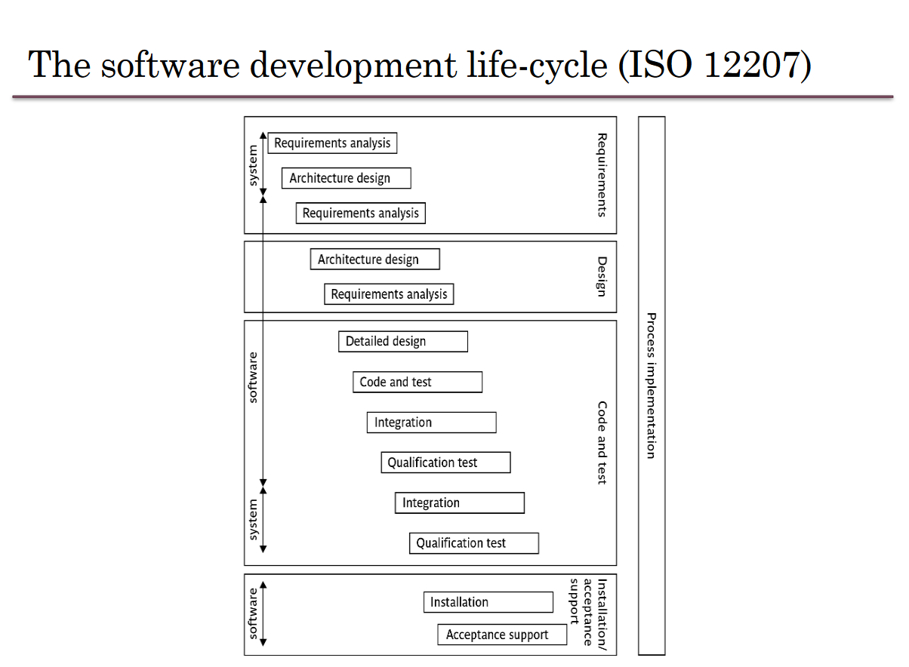

# Intro to Artificial Intelligence (SOFE3720)

| Category                     | Mark   |
|------------------------------|--------|
| In-Class Activities/Quizzes  | 15%    |
| Tutorials                    | 5%     |
| Midterm 1 (Feb. 9th)         | 20%    |
| Midterm 2 (Mar. 8th)         | 20%    |
| Final                        | 45%    |

Office Hours: Fridays 9-10 AM, SIRC 3385

**Quizzes:**
Pop-up. None dropped.

**Midterm:**
- The first exam will be on Feb. 9th during the class time.
- The second exam will be on Mar. 8th during the class time.
- No midterm deferral, marks will be added to the final exam

---

  
Lecture 1 | Chapter 1: Artificial Intelligence

  
# What is AI?
AI operates in its own "universe", systems that attempt to replicate human intelligence at a limited scale and scope. It is an attempt to reach two goals:

1. To know how "natural intelligence" works.
2. To build an intelligent "agent" or "entity".

Of these goals, only the second goal has seen significant and visible progress.

# Why is project management important?

Large amounts of money are spent on Info & Comms. Technology (ICT).

- Projects often fail; Standish Group claim only a third of ICT projects are successful. 82% were late and 43% exceeded their budget.
- Poor project management is a major factor in these failures.

# What is a project?

The definition can vary, but its most important aspects are its *planning* and *size*.

To compare:

Jobs – repetition of very well-defined and well understood tasks with very little uncertainty
Exploration – e.g. finding a cure for cancer: the outcome is very uncertain

Projects lie in the middle between a job and exploration.

A task is more 'project-like' if it is:
- Non-routine
- Planned
- Aiming at a specific target
- Carried out for a customer
- Carried out by a temporary work group
- Involving several specialisms
- Made up of several different phases
- Constrained by time and resources
- Large and/or complex

## Exercise 1.1
Which of the following is a project, a routine, or an exploration:

  
Producing an edition of a newspaper

routine

  
Building the channel tunnel.

project

  
Getting Married

project

  
A research project into what makes a good human-computer interface.

exploration

  
An investigation into the reason why a user has a problem with a computer system.

project

  
A programming assignment for a second year computing student.

project

  
Writing an operating system for a new computer

exploration

  
Installing a new version of a word processing application in an organization

routine

Invisibility, Complexity, Conformity (compliance w/ standards, rules, or laws), and Flexibility make software more problematic to build than other engineered artefacts.

Projects can be

- **In-house:** clients & employers are employed by same organization
- **Out-sourced:** clients & employers are employed by different organizations

"Project manager" could be:
- a ‘contract manager’ in the client organization
- a technical project manager in the supplier/services organization

### Activities covered by project management
Feasibility study
- Is project technically feasible and worthwhile from a business point of view?

Planning
- Only done if project is feasible

Execution
- Implement plan, but plan may be changed as we go along

## The software development life-cycle

---
