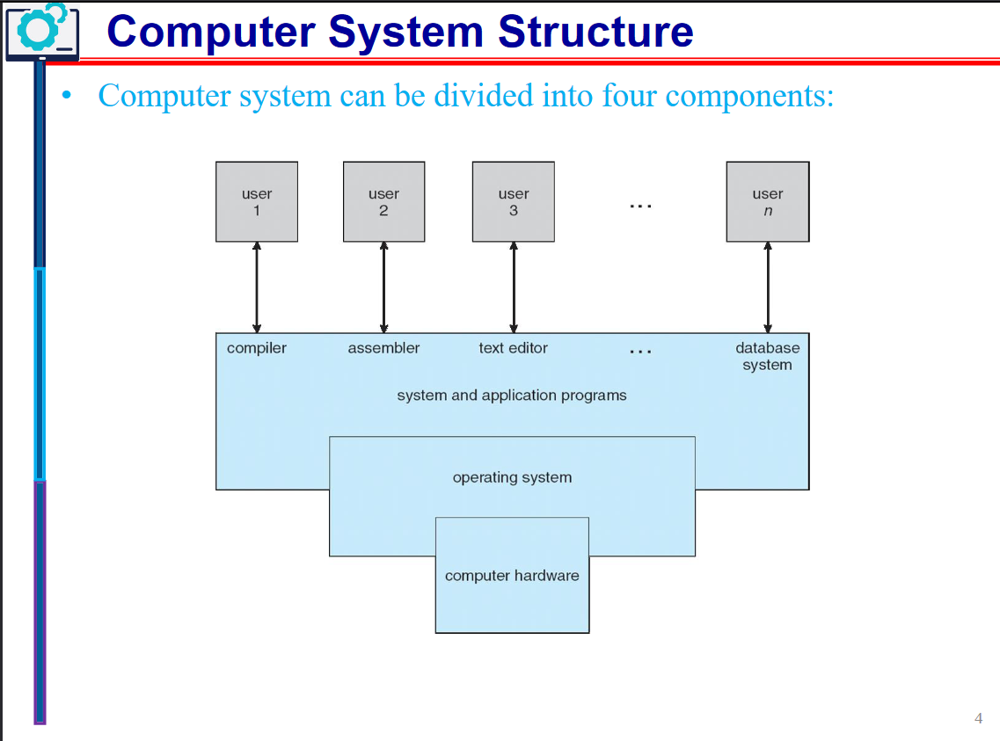
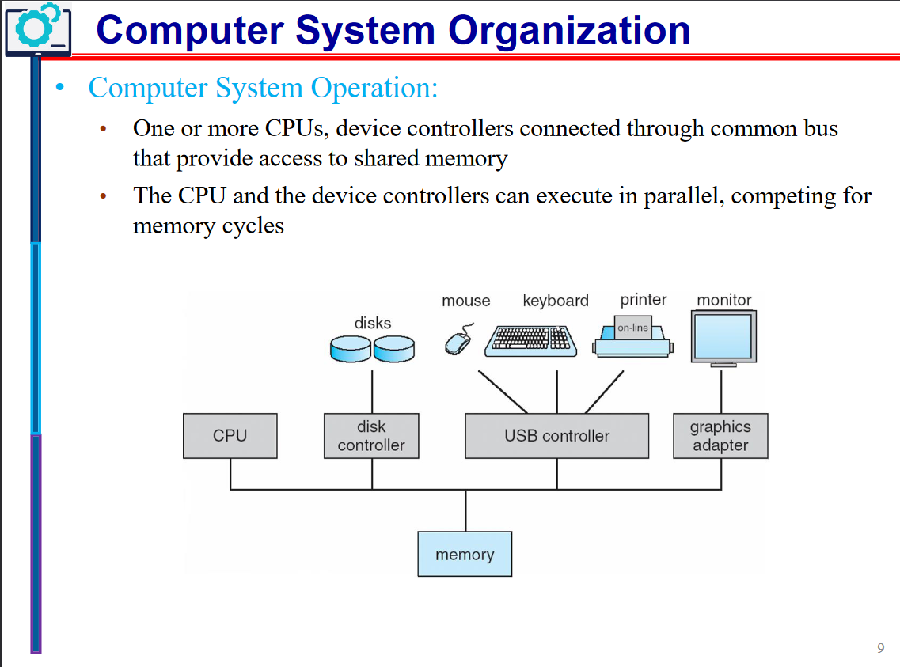

# Operating Systems (SOFE3950)

todo: fix this, catch up on lecture 1 notes.

| Category                     | Mark   |
|------------------------------|--------|
| In-Class Activities/Quizzes  | 10%    |
| Tutorials                    | 10%    |
| Labs                         | 15%    |
| Midterm (Feb. 13th)          | 20%    |
| Final                        | 45%    |

Office hours:
- Tuesday: 6 - 7 pm
- Thursday: 2 - 3 pm

**Quizzes:**
- Lockdown browser will be used in quizzes and must be done in class. 
- Expect a quiz every week. *(Lowest quiz mark dropped)*

**Midterm:**
- The exam will be on Feb. 13th during the class time. (**yes that means it's at 8pm**)
- No midterm deferral, marks will be added to the final exam
- Must pass final.

|Course Type | Location | Day | Time | Start Date |
|-|-|-|-|-|
|74025 |UA3130 |Thu |11:10am - 02:00 pm| 26/1, 9/2, 1/3, 15/3, 29/3|
|74026 |UA3130 |Thu| 11:10am - 02:00 pm |19/1, 2/2, 16/2, 8/3, 22/3,|

---

  
Lecture 1 | Introduction to OS

  
  # Introduction
*What is an Operating System?*

Acts as an intermediary b/w user of computer and computer hardware.

Operating System Goals:
- Execute user programs & make solving user problems easier
- Make computer system convenient to use
- Use computer hardware in an efficient manner.

## Computer System Hardware

Computer system can be divided into four components:

**Hardware** – provides basic computing resources
- CPU, memory, I/O devices

**Operating system**
- Controls and coordinates the use of hardware among various applications and users

**Application programs** – define the ways in which the system resources are used to solve the computing problems of the users
- Word processors, compilers, web browsers, database systems, video games

**Users**
- People, machines, other computers

# What do Operating Systems do?

***Exploring the OSes from two viewpoints***:

**User view:**

Users prefer <ins>convenience, ease of use, and good performance.</ins> Not resource utilization.

Users of delicate systems such as workstations have dedicated resources but frequently use shared resources from servers

Handheld computers (smartphones) are resource poor, optimized for usability and battery life, and some computers have little or no user interface, such as embedded computers in devices and automobiles.

**System view:**

The OS is the program that most intimately involved with the hardware. We can view the OS as a:
- Resource allocator
  - Manages all resources
  - Decides between conflicting requests for efficient and fair
resource use
- Control program
  - Controls the execution of user programs to prevent errors and improper use of the computer
 

# Computer System Organization

Common definition:
Kernel: The one program running at all times on the computer.

And two other types of programs:
- a system program (ships with the operating system)
- an application program.

## Computer System Operation

I/O devices and the CPU can execute concurrently. Each device controller is **in charge of a particular device type** and has a **local buffer**.

CPU moves data from/to main memory to/from local buffers, I/O moves data from the device to local buffer of controller, of which the controller informs the CPU that it has finished its operation by causing an interrupt.

The bootstrap program is typically stored in **ROM** or **EEPROM**, generally known as firmware. 

1. It initializes all aspects of the system,
2. Loads operating system kernel and starts execution
3. The kernel then starts providing services to the system and its users.
4. Some services are provided outside of the kernel, by system programs that are loaded into memory at boot time to become system processes, or system daemons that run the entire time the kernel is running.
5. The system is now running and waiting for an event to occur.

## Common Function Interrupts

OSes are **interrupt driven.**

Occurrences of events are usually signaled via interrupts by either:

The **hardware,** triggering an interrupt by sending a signal to the CPU, or, 

the **software,** triggering an interrupt by executing a **system call.**

Interrupt transfers control to the interrupt service routine generally, through the **interrupt vector**, which contains the addresses of all the service routines.

Interrupt architecture must save the address of the interrupted instruction. 

A trap or exception is a software-generated interrupt caused either by an error or a user request.

### Interrupt Handling
OS preserves state of CPU by storing registers and program counter, and determines which kind of interrupt has occurred:

- **polling**
- **vectored** interrupt system

Separate segments of code determine what happens for each interrupt type.

### Storage Structure
**Main memory**: only large storage media that the CPU can access directly
- Random access
- Typically, volatile

**Secondary storage**: extension of main memory that provides large nonvolatile storage capacity

**Hard disks**: rigid metal or glass platters covered with magnetic recording material
- Disk surface is logically divided into tracks, which are subdivided into sectors
- The disk controller determines the logical interaction between the device and the computer

**Solid-state disks**: faster than hard disks, nonvolatile

### Storage Hierarchy

---

  
Lecture 2 | Operating System Structures

---

  
Lecture 3 | ???

---

  
Lecture 4 | ???

---
