# Operating Systems (SOFE3950)

todo: fix this, catch up on lecture 1 notes.

| Category                     | Mark   |
|------------------------------|--------|
| In-Class Activities/Quizzes  | 10%    |
| Tutorials                    | 10%    |
| Labs                         | 15%    |
| Midterm (Feb. 13th)          | 20%    |
| Final                        | 45%    |

Office hours:
- Tuesday: 6 - 7 pm
- Thursday: 2 - 3 pm

**Quizzes:**
- Lockdown browser will be used in quizzes and must be done in class. 
- Expect a quiz every week. *(Lowest quiz mark dropped)*

**Midterm:**
- The exam will be on Feb. 13th during the class time. (**yes that means it's at 8pm**)
- No midterm deferral, marks will be added to the final exam
- Must pass final.

|Course Type | Location | Day | Time | Start Date |
|-|-|-|-|-|
|74025 |UA3130 |Thu |11:10am - 02:00 pm| 26/1, 9/2, 1/3, 15/3, 29/3|
|74026 |UA3130 |Thu| 11:10am - 02:00 pm |19/1, 2/2, 16/2, 8/3, 22/3,|

---

  
Lecture 1 | Introduction to OS

  
  # Introduction
*What is an Operating System?*

Acts as an intermediary b/w user of computer and computer hardware.

Operating System Goals:
- Execute user programs & make solving user problems easier
- Make computer system convenient to use
- Use computer hardware in an efficient manner.

## Computer System Hardware
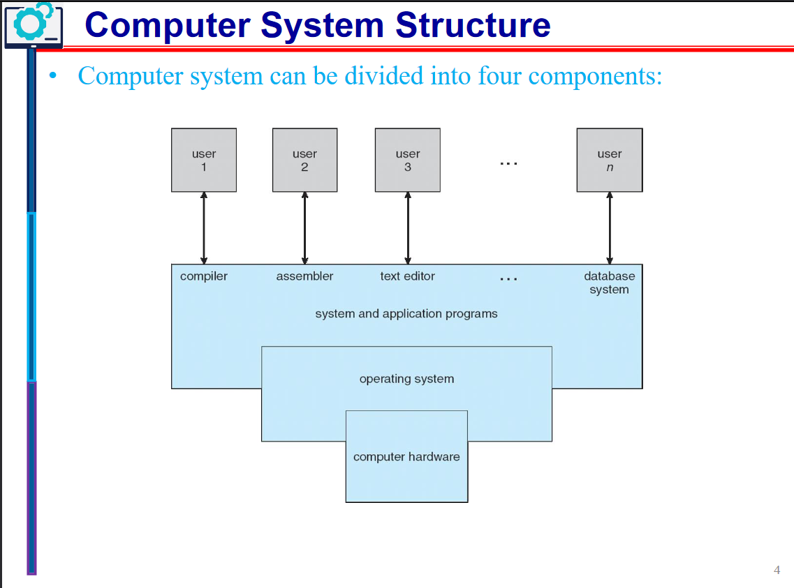

Computer system can be divided into four components:

**Hardware** – provides basic computing resources
- CPU, memory, I/O devices

**Operating system**
- Controls and coordinates the use of hardware among various applications and users

**Application programs** – define the ways in which the system resources are used to solve the computing problems of the users
- Word processors, compilers, web browsers, database systems, video games

**Users**
- People, machines, other computers

# What do Operating Systems do?

***Exploring the OSes from two viewpoints***:

**User view:**

Users prefer <ins>convenience, ease of use, and good performance.</ins> Not resource utilization.

Users of delicate systems such as workstations have dedicated resources but frequently use shared resources from servers

Handheld computers (smartphones) are resource poor, optimized for usability and battery life, and some computers have little or no user interface, such as embedded computers in devices and automobiles.

**System view:**

The OS is the program that most intimately involved with the hardware. We can view the OS as a:
- Resource allocator
  - Manages all resources
  - Decides between conflicting requests for efficient and fair
resource use
- Control program
  - Controls the execution of user programs to prevent errors and improper use of the computer
 

# Computer System Organization

Common definition:
Kernel: The one program running at all times on the computer.

And two other types of programs:
- a system program (ships with the operating system)
- an application program.

## Computer System Operation

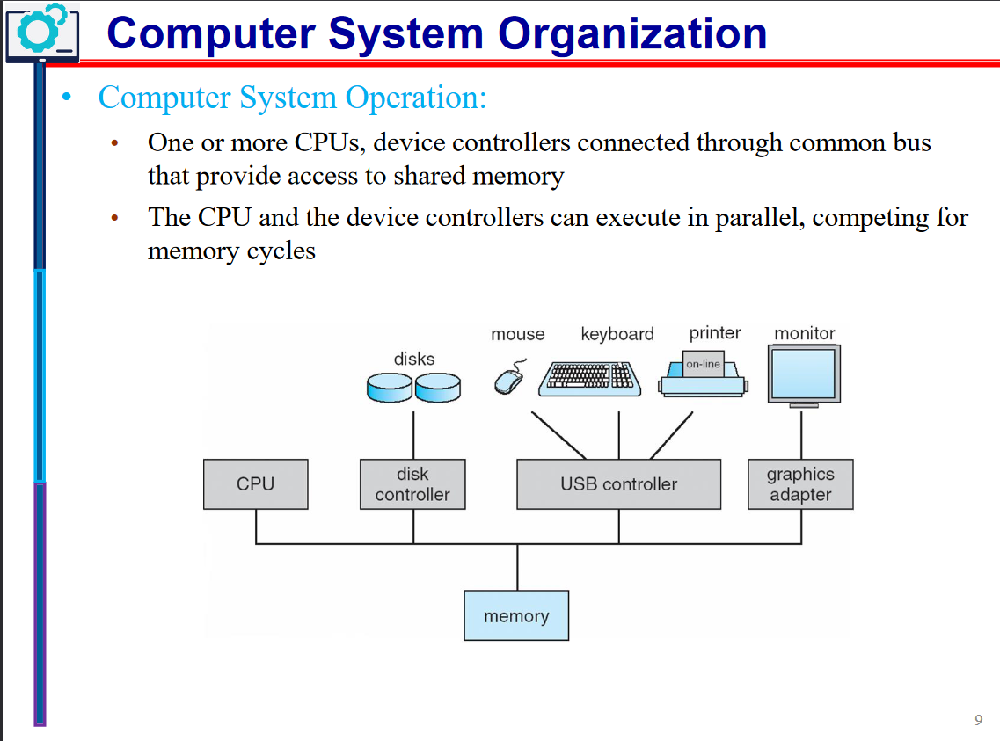

I/O devices and the CPU can execute concurrently. Each device controller is **in charge of a particular device type** and has a **local buffer**.

CPU moves data from/to main memory to/from local buffers, I/O moves data from the device to local buffer of controller, of which the controller informs the CPU that it has finished its operation by causing an interrupt.

The bootstrap program is typically stored in **ROM** or **EEPROM**, generally known as firmware. 

1. It initializes all aspects of the system,
2. Loads operating system kernel and starts execution
3. The kernel then starts providing services to the system and its users.
4. Some services are provided outside of the kernel, by system programs that are loaded into memory at boot time to become system processes, or system daemons that run the entire time the kernel is running.
5. The system is now running and waiting for an event to occur.

## Common Function Interrupts

OSes are **interrupt driven.**

Occurrences of events are usually signaled via interrupts by either:

The **hardware,** triggering an interrupt by sending a signal to the CPU, or, 

the **software,** triggering an interrupt by executing a **system call.**

Interrupt transfers control to the interrupt service routine generally, through the **interrupt vector**, which contains the addresses of all the service routines.

Interrupt architecture must save the address of the interrupted instruction. 

A trap or exception is a software-generated interrupt caused either by an error or a user request.

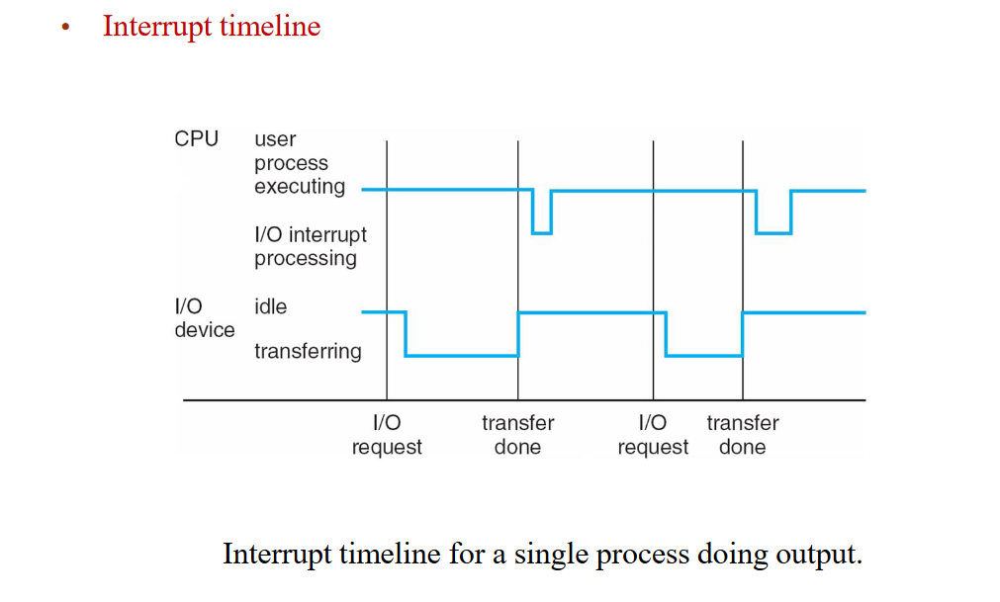

### Interrupt Handling
OS preserves state of CPU by storing registers and program counter, and determines which kind of interrupt has occurred:

- **polling**
- **vectored** interrupt system

Separate segments of code determine what happens for each interrupt type.

### Storage Structure
**Main memory**: only large storage media that the CPU can access directly
- Random access
- Typically, volatile

**Secondary storage**: extension of main memory that provides large nonvolatile storage capacity

**Hard disks**: rigid metal or glass platters covered with magnetic recording material
- Disk surface is logically divided into tracks, which are subdivided into sectors
- The disk controller determines the logical interaction between the device and the computer

**Solid-state disks**: faster than hard disks, nonvolatile

### Storage Hierarchy

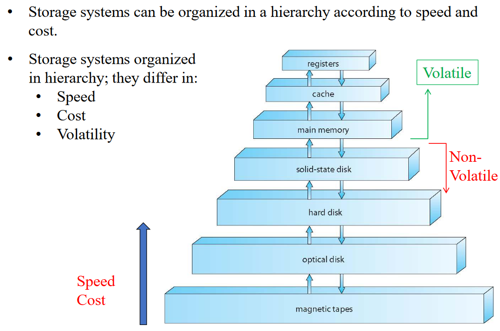

### Caching
Copying information into faster storage system; main memory can be viewed as a cache for secondary storage

It is an important principle, that is performed at many levels in a computer (in hardware, operating system, software). Information in use copied from slower to faster storage temporarily. Faster storage (cache) checked first to determine if information is there
- If it is, information used directly from the cache (fast)
- If not, data copied to cache and used there

- Cache smaller than storage being cached
- Cache management is an important design problem
- Cache size and replacement policy

### Storage Definitions and Notation Review:
- The basic unit of computer storage is the bit.
- A byte is 8 bits, and on most computers, it is the smallest convenient chunk of storage.
- A word, which is a given computer architecture’s native unit of data. A word is made up of one or more bytes.
- Computer storage, along with most computer throughput, is generally measured and manipulated in bytes and collections of bytes.

|Name|Amount|
|-|-|
| kilobyte (KB) | 1,024 bytes (210) |
| megabyte (MB) | 1,0242 bytes (220) |
| gigabyte (GB) | 1,0243 bytes (230) |
| terabyte (TB) | 1,0244 bytes (240) |
| petabyte (PB) | 1,0245 bytes (250) |

## I/O Structure

A general-purpose computer system consists of CPUs and multiple device controllers that are connected through a common bus. 

Each device controller is in charge of a specific type of devices. Operating systems have a device driver for each device controller to manage I/O.

Interrupt-driven I/O is good for moving small amounts of data:

1. The device driver loads the appropriate registers within the device controller.
2. The device controller determines what action to take (such as “read a character from the keyboard”).
3. The controller transfers the data from the device to its local buffer.
4. Then the device controller informs the device driver via an interrupt that it has finished its operation.
5. The device driver then returns control to the operating system

Produces <ins>high overhead</ins> when moving bulk data; DMA is used to solve this.

### Direct Memory Access (DMA) Structure

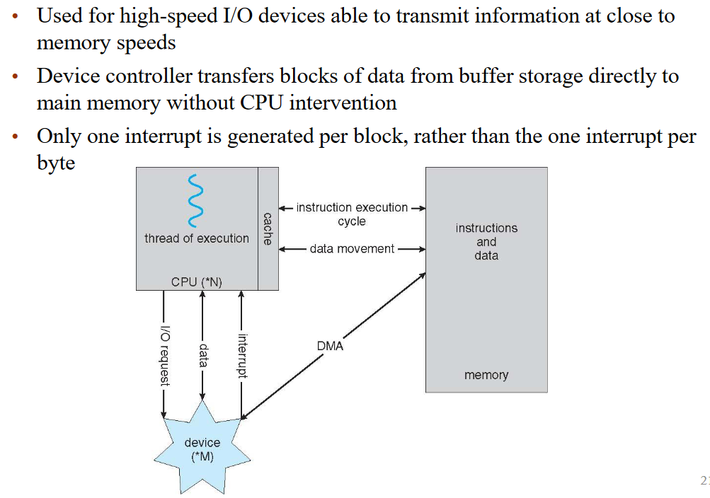

### Single-Processor Systems:
- Most systems use a single general-purpose processor
  - Most systems have special-purpose processors as well for keyboard, disks, etc.

### Multiprocessors Systems
- Growing in use and importance
  - Also known as parallel systems, or multicore systems
  - They have two or more processors in close communication, sharing the computer resources
  - Advantages include:
    1. Increased throughput: more work done in less time
    2. Economy of scale: cost less than equivalent multiple single-processor systems
    3. Increased reliability: graceful degradation or fault tolerance

The multiple-processor systems in use today are of two types:
- Asymmetric Multiprocessing: each processor is assigned a specific task.
  - This scheme defines a boss–worker relationship. The boss processor schedules and allocates work to the worker processors.
- Symmetric Multiprocessing (SMP):
  - It is the most common
  - All processors are peers: each processor performs all tasks
  - Symmetric Multiprocessing Architecture:
 
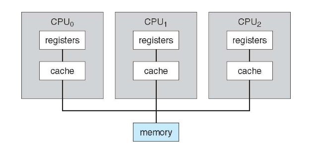
 
### Multi-Core CPUs

They are more efficient than multiple chips with single cores because on-chip communication is faster than between-chip communication.

- Uses significantly less power than multiple single-core chips
- These multicore CPUs appear to the operating system as N standard processors.
- dual-core design with two cores on the same chip

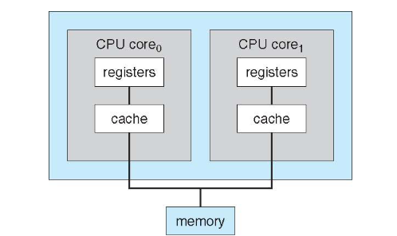

### Clustered Systems

They are like multiprocessor systems, but multiple systems working together, usually sharing storage via a storage-area network (SAN)
- Provides a high-availability service which survives failures
- Asymmetric clustering has one machine in hot-standby mode
- Symmetric clustering has multiple nodes running applications, monitoring each other
- Some clusters are for high-performance computing (HPC)
- Applications must be written to use parallelization
- Some have distributed lock manager (DLM) to avoid conflicting operations

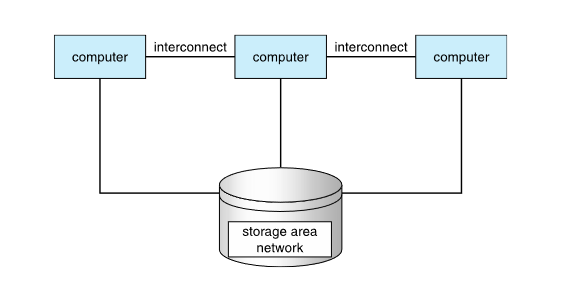

# Operating System Structure

### Important Aspects of Operating Systems
- _**Multiprogramming (Batch system)**_ is needed for efficiency:
  - Single user cannot keep CPU and I/O devices busy at all times
  - Multiprogramming organizes jobs (code and data), so CPU always has one to execute
  - A subset of total jobs in system is kept in memory
  - One job selected and run via **job scheduling**
  - When it must wait (for I/O for example), OS switches to another job
 
- _**Timesharing (multitasking)**_ is a logical extension to multiprogramming in which CPU switches jobs so frequently that users can interact with each job while it is running, creating interactive computing
  - Response time should be < 1 second
  - Each user has at least one program executing in memory -> process
  - If several jobs ready to run at the same time -> CPU scheduling
  - If processes don't fit in memory, swapping moves them in and out to run
  - Virtual memory allows execution of processes that are larger than actual physical memory

## Operating System Operations

### Dual-Mode and Multi-Mode Operation
- To ensure the proper execution of the OS, we must be able to distinguish between the execution of operating-system code and user-defined code.
- Therefore, computer systems provide hardware bit to differentiate among various modes of execution.
- **Dual-mode** operation allows OS to protect itself and other system components
  - **User** mode and **kernel** mode (called _supervisor_, _system_, or _privileged_ mode)
  - **Mode bit** provided by hardware (kernel (0), user (1))
    - Provides ability to distinguish when system is running user code or kernel code
    - Some instructions designated as **privileged**, only executable in kernel mode (such as: switch mode, I/O control, timer management, and interrupt management instructions)
  - Transition from user to kernel mode:
    - _System call_ changes mode to kernel, return from call resets it to user

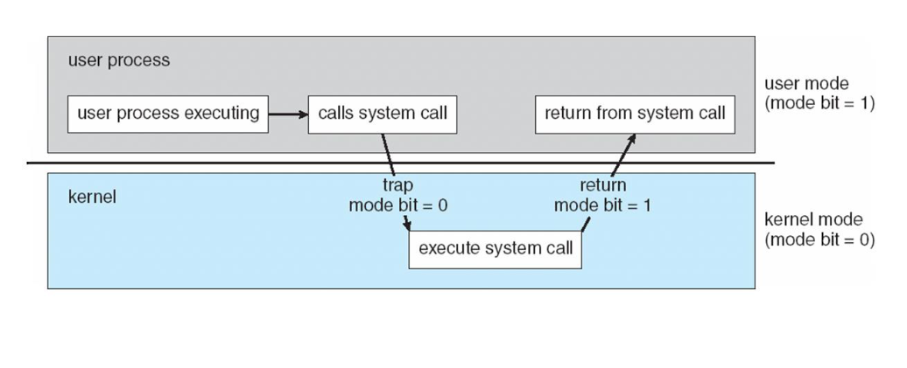

The concept of modes can be extended beyond two modes:
- Increasingly CPUs support multi-mode operations
- CPU uses more than one bit to set and test the mode.

Example:

CPUs that support virtualization frequently, have a separate mode to indicate when the virtual machine manager (VMM) and the virtualization management software is in control of the system. In this mode, the VMM has more privileges than user processes but fewer than the kernel

### Transition from User to Kernel Mode
To ensure that the OS maintains control over the CPU, we use timers, which are used to prevent a user program from getting stuck in an infinite loop / process hogging resources
- Timer is set to interrupt the computer after some time period
- Keep a counter that is decremented by the physical clock.
- Operating system set the counter (it is a privileged instruction)
- When counter reaches zero, it generates an interrupt
- Set up before scheduling process to regain control or terminate program that exceeds allotted time

# Process Management

A process is a program in execution. It is a unit of work within the system.

**Program** is a _passive_ entity.

**Process** is an _active_ entity.

Process needs resources to accomplish its task
- CPU, memory, I/O, files
- Initialization data

Process termination requires reclaim of any reusable resources

Single-threaded process has one program counter specifying location of next instruction to execute
- Process executes instructions sequentially, one at a time, until completion

Multi-threaded process has one program counter per thread
- Typically, a system has many processes, some user, some operating system running concurrently on one or more CPUs
  - Concurrency by multiplexing the CPUs among the processes / threads

## Process Management Activities

The operating system is responsible for the following activities in
connection with process management:
- Scheduling processes and threads on the CPUs
- Creating and deleting both user and system processes
- Suspending and resuming processes
- Providing mechanisms for process synchronization, process communication, and deadlock handling

## Memory Management

To execute a program all (or part) of the instructions _and_ all (or part) of the data that is needed by the program must be in memory. Memory management determines what is in memory and when.
- Optimizing CPU utilization and computer response to users

This creates the need for memory management which has the following activities:
- Keeping track of which parts of memory are currently being used and by whom
- Deciding which processes (or parts of processes) and data to move into and out of memory
- Allocating and deallocating memory space as needed

## Storage Management

### Storage Management

OS provides uniform, logical view of information storage. It abstracts physical properties to a logical storage unit - file. Each medium is controlled by device (i.e., disk drive, tape drive)and varying properties include access speed, capacity, data-transfer rate, access method (sequential or random).

### File-System management
It is one of the most visible components of an operating system, and files are usually organized into directories. Access control on most systems to determine who can access what.

OS activities include:
- Creating and deleting files and directories
- Support primitives to manipulate files and directories
- Mapping files onto secondary storage
- Backup files onto stable (non-volatile) storage media

### Mass-Storage Management:
- Usually, disks used to store data that does not fit in main memory or data that must be kept for a “long” period of time
- Proper management is of central importance
- Entire speed of computer operation hinges on disk subsystem and its algorithms
- OS is responsible for the following activities:
  - Free-space management
  - Storage allocation
  - Disk scheduling
  - Some storage need not be fast
  - Tertiary storage includes optical storage (CD, DVD), magnetic tape
  - Still must be managed – by OS or applications
  - Varies between WORM (write-once, read-many-times) and RW (read-write) formats

### Caching
- Information is normally kept in main memory, when it is used, it is copied into a faster storage system (the cache) on a temporary basis.
- _Cache management_ is an important design problem.
  - Cache size and the replacement policy can result in greatly increased performance
- Main memory can be viewed as a fast cache for secondary storage
- Performance of Various Levels of Storage

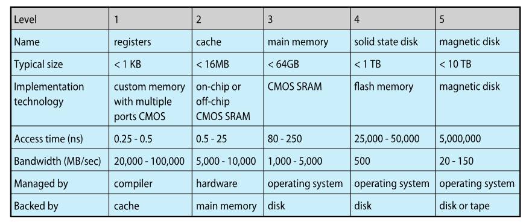

### Cache Coherency
- In a hierarchical storage structure, the same data may appear in different levels of the storage system.
- For example,
  - Migration of integer “A” from Disk to Register

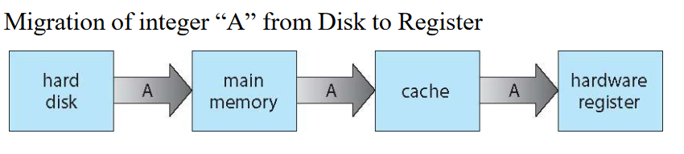

  - Multitasking environments must be careful to use most recent value, no matter where it is stored in the storage hierarchy
  - Multiprocessor environment must provide cache coherency in hardware such that all CPUs have the most recent value in their cache
  - Distributed environment situation even more complex
  - Several copies of a datum can be kept in different computers
  - Distributed systems must ensure that, when a replica is updated in one place, all other replicas are brought up to date on time

## I/O Systems:
- One purpose of OS is to hide peculiarities of hardware devices from the user
- The I/O subsystem consists of several components:
- Memory management of I/O including buffering (storing data temporarily while it is being transferred), caching (storing parts of data in faster storage for performance), spooling (the overlapping of output of one job with input of other jobs)
- General device-driver interface
- Drivers for specific hardware devices
- Only the device driver knows the peculiarities of the specific device to which it is assigned.

# Protection & Security

**Protection**: any mechanism for controlling access of processes or users to resources defined by the OS

**Security**: defense of the system against internal and external attacks

Huge range, including denial-of-service, worms, viruses, identity theft, theft of service
- Systems generally first distinguish among users, to determine who can do what
  - User identities (**user IDs**, security IDs) include name and associated number, one per user
  - User ID then associated with all files, processes of that user to determine access control
  - Group identifier (**group ID**) allows set of users to be defined and controls managed, then also associated with each process and file
  - **Privilege escalation** allows user to change to effective ID with more rights

# Kernel Data Structures
## Lists, Stacks, and Queues:
- An array is a simple data structure in which each element can be accessed directly.
  - For example, main memory is constructed as an array.
- A list is the most fundamental data structures in computer science.
  - The items in a list must be accessed in a particular order.
  - Linked list is the most common method for implementing the list,
  - Lists are used for constructing more powerful data structures, such as stacks and queues

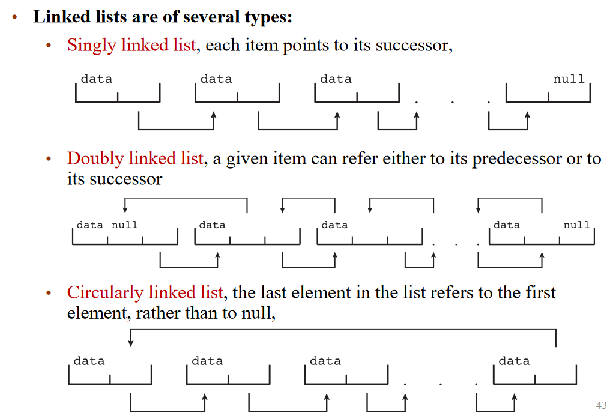

**Stack:**
- It is a sequentially ordered data structure that uses the last in, first out **(LIFO)** principle for adding and removing items

**Queue:**
- It is a sequentially ordered data structure that uses the first in, first out (FIFO) principle

## Trees:
- A _tree_ is a data structure that can be used to represent data hierarchically.
- Data values in a tree structure are linked through parent–child relationships
- In a _binary tree_, a parent may have at most two children (left child and the right child).
- A _binary search tree_ additionally requires an ordering between the parent’stwo children in which left_child <= right_child.
  - Search performance is O(n)
- An algorithm can be used to create a balanced binary search tree.
  - A tree containing **n** items has at most log2(n) levels,
  - Search performance is O(log2(n))

## Hash Functions and Maps:

A hash function takes data as its input, performs a numeric operation on this data, and returns a numeric value, of which, can then be used as an index into a table (typically an array) to quickly retrieve the data.

- Performance can be as good as O(1)
- Hash functions are used extensively in operating systems.
- Hash collision can be accommodated by having a linked list at that table location that contains all of the items with the same hash value
- A hash map, which associates (or maps) [key:value] pairs using a hash function

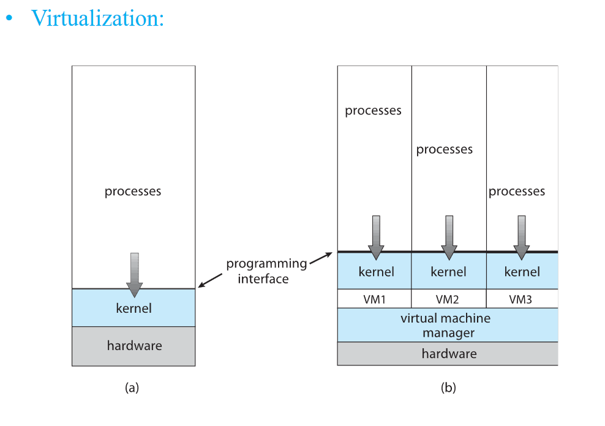

## Bitmaps:
- A bitmap is a string of n binary digits that can be used to represent the status of n items.
- Example,
  - Consider the bitmap 001011101
- Resources 2, 4, 5, 6, and 8 are unavailable; resources 0, 1, 3, and 7 are available.

# Computing Environments
## Traditional Computing
- Stand-alone general purpose machines
- But blurred as most systems interconnect with others (i.e., the Internet)
- Portals provide web access to internal systems
- Network computers (thin clients) are like Web terminals
- Mobile computers interconnect via wireless networks
- Networking becoming ubiquitous – even home systems use firewalls to protect home computers from Internet attacks

## Mobile Computing
- Handheld smartphones, tablets, etc
- What is the functional difference between them and a “traditional” laptop?
- Extra feature – more OS features (GPS, gyroscope)
- Allows new types of apps like augmented reality
- Use IEEE 802.11 wireless, or cellular data networks for connectivity
- Leaders are **Apple iOS** and **Google Android**

## Distributed Computing
- Collection of separate, possibly heterogeneous, systems networked together
  - Network is a communications path, _TCP/IP_ most common
    - Local Area Network (LAN)
    - Wide Area Network (WAN)
    - Metropolitan Area Network (MAN)
    - Personal Area Network (PAN)
- Network Operating System provides features between systems across network
- Communication scheme allows systems to exchange messages
- Illusion of a single system

## Client-Server
- Many systems now servers, responding to requests generated by clients
  - Compute-server system provides an interface to client to request services (i.e., database)
    - Example: A server running a database that responds to client requests for data
  - File-server system provides interface for clients to store and retrieve files
    - Example: a web server that delivers files to clients running web browsers.

## Peer-to-Peer
- Another model of distributed system
- P2P does not distinguish clients and servers
  - Instead, all nodes are considered peers
  - May each act as client, server or both
  - Node must join P2P network
    - Registers its service with central lookup service on network, or
    - Broadcast request for service and respond to requests for service via discovery protocol
  - Examples include Napster and Gnutella, Voice over IP (VoIP) such as Skype

## Virtualization
- Allows operating systems to run as applications within other OSes
  - Vast and growing industry
- Emulation is used when the source CPU type is different from the target type (i.e. PowerPC to Intel x86)
  - Generally slowest method
  - When computer language not compiled to native code – Interpretation
- Virtualization – OS natively compiled for CPU, running guest OSes also natively compiled
  - Consider VMware running Win10 guests, each running applications, all on native Win10 host OS
  - VMM (virtual machine Manager) provides virtualization services
- Use cases involve laptops and desktops running multiple OSes for exploration or compatibility
  - Apple laptop running Mac OS X host, Windows as a guest
  - Developing apps for multiple OSes without having multiple systems
  - QA testing applications without having multiple systems
  - Executing and managing compute environments within data centers
- VMM can run natively, in which case they are also the host
  - There is no general-purpose host them like (VMware ESX and CitrixXenServer) but rather they are the host

## Cloud Computing
- Delivers computing, storage, even apps as a service across a network
- It is logical extension of virtualization because it uses virtualization as the base for its functionality.
  - Amazon Elastic Compute Cloud (EC2) has thousands of servers, millions of virtual machines, petabytes of storage available across the Internet, pay based on usage
- Many types of cloud computing:
  - Public cloud – available via Internet to anyone willing to pay
  - Private cloud – run by a company for the company’s own use
  - Hybrid cloud – includes both public and private cloud components
  - Software as a Service (SaaS) – one or more applications available via the Internet (i.e., word processor)
  - Platform as a Service (PaaS) – software stack ready for application use via the Internet (i.e., a database server)
  - Infrastructure as a Service (IaaS) – servers or storage available over Internet (i.e., storage available for backup use)

- Cloud computing environments composed of traditional OSes, plus VMMs, plus cloud management tools
  - Internet connectivity requires security like firewalls
  - Load balancers spread traffic across multiple applications
 
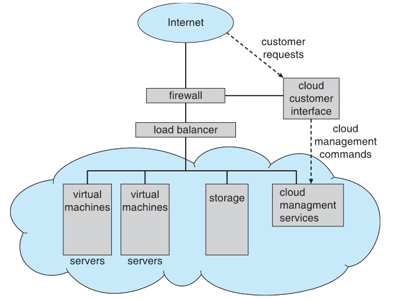

# Open-Source Operating Systems

- Operating systems made available in source-code format rather than just binary closed-source
- Counter to the copy protection and Digital Rights Management (DRM) movement
- Started by Free Software Foundation (FSF), which has “copyleft” GNU Public License (GPL)
- Examples include GNU/Linux and BSD UNIX (including core of Mac OS X), and many more
- Can use VMM like VMware Player (Free on Windows), Virtualbox (open source and free on many platforms - http://www.virtualbox.com)
  - Used to run guest operating systems for exploration
  

---

  
Lecture 2 | Operating System Structures

# Operating System Services

Operating systems provide an environment for execution of programs and services to programs and users. The OS can be studied from three different angles:
- The services the OS provides
- The interface that the OS makes available to users and programmers
- The OS components and their interconnections.

1) User interface: Almost all operating systems have a user interface (UI). It has several forms:
- Command-Line (CLI)
- Graphics User Interface (GUI)
- Batch interface: commands entered into files, to be executed.

2) Program execution: The system must be able to load a program into memory and to run that program, end execution, either normally or abnormally (indicating error)

3) I/O operations: A running program may require I/O, which may involve a file or an I/O device

4) 4. File-system manipulation: The file system is of particular interest. Programs need to read and write files and directories, create and delete them, search them, list file information, permission management.

5) Communications: Processes may exchange information, on the same computer or between computers over a network
- Communications may be via shared memory or through message passing (packets moved by the OS)

6) Error detection: OS needs to be constantly aware of possible errors
- May occur in the CPU and memory hardware, in I/O devices, in user program
- For each type of error, OS should take the appropriate action to ensure correct and consistent computing
- Debugging facilities can greatly enhance the user's and programmer's abilities to efficiently use the system

7) Resource allocation: When multiple users or multiple jobs running concurrently, resources must be allocated to each one of them
- Many types of resources: CPU cycles, main memory, file storage, I/O devices.

8) Accounting: To keep track of which users use how much and what kinds of computer resources

9) Protection and security: The owners of information stored in a multiuser or networked computer system may want to control use of that information, concurrent processes should not interfere with each other
- Protection controlling the access to system resources
- Security securing the system from outsiders requires user authentication, and defending external I/O devices from invalid access attempts

todo: add images

# User Operating System Interface

## Command interpreters
CLI or command interpreter allows direct command entry. Sometimes implemented in kernel, sometimes by system program, and can have multiple flavors implemented called shells
- Primarily fetches a command from user and executes it
- Sometimes commands built-in, sometimes just names of programs
-  If the latter, adding new commands doesn’t require shell modification

In UNIX and Linux systems, there are different shells to choose from:
- Bourne shell,
- C shell,
- Bourne-Again shell,
- Korn shell,

## Graphical User Interfaces (GUI)
- User-friendly desktop metaphor interface
- Usually mouse, keyboard, and monitor
- Icons represent files, programs, actions, etc
- Various mouse buttons over objects in the interface cause various actions (provide information, options, execute function, open directory (known as a folder)
- Invented at Xerox PARC in 1973

Many systems now include both CLI and GUI interfaces
- Microsoft Windows is GUI with CLI “command” shell
- Apple Mac OS X is “Aqua” GUI interface with UNIX kernel underneath and shells available
- Unix and Linux have CLI with optional GUI interfaces (CDE, KDE, GNOME)

## Touchscreen Interfaces
- Touchscreen devices require new interfaces
  - Mouse not possible or not desired
  - Actions and selection based on gestures
  - Virtual keyboard for text entry
- Voice commands.

- The Mac OS X (which is in part implemented using a UNIX kernel), provides both an Aqua interface and a command-line interface.

# System Calls

They provide an interface to the services made available by an operating system. Typically written in a high-level language (C or C++), some by assembly. They are mostly accessed by programmers (or programs) via a high-level Application Programming Interface (API) rather than direct system call use. Programmers access the API through a library (called libc in UNIX/Linux)
 
The three most common APIs are:
- Win32 API for Windows,
- POSIX API for POSIX-based systems (includes most versions of UNIX, Linux, and Mac OS X)
- Java API for the Java virtual machine (JVM)

Note that the system-call names used throughout this course are *generic.*

## System Call Implementation

Typically, a number is associated with each system call, and the system-call interface maintains a table indexed according to these numbers. The system call interface invokes the intended system call in OS kernel and returns status of the system call and any return values.
- Example: the Windows function CreateProcess() actually invokes the NTCreateProcess() system call in the Windows kernel.
  - The caller need to know nothing about how the system call is implemented
  - Just needs to obey API and understand what OS will do as a result call
  - Most details of OS interface hidden from programmer by API
  - Managed by run-time support library (set of functions built into libraries included with compiler)

  

## System Call Parameter Passing
More information is usually required than simply the identity of the desired system call.
- Exact type and amount of information vary according to OS and call
- Three general methods used to pass parameters to the OS
  - **Passing the parameters in registers**
    - It is the simplest, but it may be more parameters than registers
  - **Parameters stored in a *block*, or *table***, in memory, and address of block passed as a parameter in a register
    - Such as in Linux and Solaris
  - **Parameters placed, or pushed, onto the stack** by the program and popped off the stack by the operating system
  
- Block and stack methods do not limit the number or length of parameters being passed

# Types of System Calls

System calls can be grouped into six major categories:
1. Process control
2. File manipulation
3. Device manipulation
4. Information maintenance
5. Communications
6. Protection

## 1. Process Control

- create process, terminate process
- end, abort
- load, execute
- get process attributes, set process attributes
- wait for time
- wait event, signal event
- allocate and free memory
- Dump memory if error
- Debugger for determining bugs, single step execution
- Locks for managing access to shared data between processes
- Such as acquire_lock() and release_lock()

### Example: MS-DOS
- It is a single-tasking system
- Shell (command interpreter) invoked when system booted
- It uses a simple method to run program and does not create a new process
- It uses a single memory space

- Loads program into memory, overwriting itself but not the kernel
- When program exit, the remaining from the shell reloads back the rest from the hard disk and then ready to run new program

### Example: FreeBSD (Berkeley Software Distribution)

- It is Unix variant
- It is a multitasking system
- When user login, the system invokes user's choice of shell (many shells to choose from)
- To start a new process, the shell executes a fork() system call
- Then it loads the selected program into memory by executing the exec() system call, and the program is executed
- Then Shell waits for process to terminate or continues with other user commands
- When a process is done, it executes exit() system call to terminate and returns either:

code = 0 → no error
code > 0 → error code

## 2. File Manipulation

- create file, delete file
- open, close file
- read, write, reposition, move, copy
- get and set file attributes
  - File name, file type, protection codes, accounting information
- Operations for directories

## 3. Device Manipulation

A process may need several resources to execute such as main memory, disk drives, access to files, etc.
  - request device, release device
  - read, write, reposition
  - get device attributes, set device attributes
  - logically attach or detach devices

## 4. Information Maintenance

They are needed for transferring information between the user program and the operating system
- get time or date, set time or date
- get system data, set system data
- get and set process, file, or device attribute

## 5. Communications

- create, delete communication connection
- transfer status information
- attach and detach remote devices
- There are two common models of interprocess communication:
  - The message-passing model: for exchanging smaller amounts of data
    - send, receive messages to host name or process name
      - From client to server

## 6. Protection

- To control access to the resources
- Get and set permissions
- Allow and deny user access

# System Programs

System programs (system utilities) provide a convenient environment for program development and execution. Some  system programs are user interfaces for system calls while others are more complex programs.

They can be divided into:
- File management
- Status information
- File modification
- Programming language support
- Program loading and execution
- Communications
- Background services
- Application programs

Most users’ view of the operating system is defined by the application and system programs, rather than by the actual system calls.

<ins>File management</ins>

- Create, delete, copy, rename, print, dump, list, and generally manipulate files and directories

<ins>Status information</ins>

- Some programs that ask the system for info about date, time, amount of available memory, disk space, number of users
- Others provide detailed performance, logging, and debugging information
- These programs are typically format and print the output to the terminal or other output devices
- Some systems implement a registry which is used to store and retrieve configuration information

<ins>File modification</ins>

- Text editors to create and modify files
- Special commands to search contents of files or perform transformations of the text

<ins>Programming-language support</ins>

- Compilers, assemblers, debuggers and interpreters sometimes provided for common programming languages (such as C, C++, Java, and PERL)

<ins>Program loading and execution</ins>

- The system may provide absolute loaders, relocatable loaders, linkage editors, and overlay-loaders, debugging systems for higher-level and machine language

<ins>Communications</ins>

- Provide the mechanism for creating virtual connections among processes, users, and computer systems
  - Allow users to send messages to one another's screens, browse web pages, send electronic-mail messages, log in remotely, transfer files from one machine to another

<ins>Background Services</ins>

- Launched at boot time
  - Some form system startup, then terminate
  - Some from system boot to shutdown (called daemons or services)
    - Provide facilities like disk checking, process scheduling, error logging, printing, etc.
    - Run in user context not in kernel context
    - Known as **services, subsystems, daemons**

<ins>Application programs</ins>

- Don’t pertain to system, and not typically considered part of OS
- Run by users by command line, mouse click, finger poke
- Such as Web browsers, word processors and text formatters, spreadsheets, database systems, compilers, plotting and statistical-analysis packages, and games.

# Operating System Design and Implementation

Specifying and designing an OS is a highly creative task of software engineering. The principles for designing an OS are:

1. Design goals:
- Internal structure of different Operating Systems can vary widely
- Start the design by defining the goals and specifications
- Which are affected by choice of hardware, and type of system: batch, time sharing, single user, multiuser, distributed, real time, or general purpose
- The requirements are hard to define but they can be divided into:
  - User goals:
    - The OS should be convenient to use, easy to learn, reliable, safe, and fast
  - Designers goals:
    - The OS should be easy to design, implement, and maintain, as well as flexible, reliable, error-free, and efficient
   

  
2. Separation of mechanisms and policies
- Policy: What will be done?
- Mechanism: How to do it?

The separation of policy from mechanism is a very important principle, since it allows maximum flexibility if policy decisions are to be changed later

Example:
- The timer construct is a mechanism for ensuring CPU protection, but deciding how long the timer is to be set for a particular user is a policy decision.

3. Implementation
- Much variation
  - Early OSes are implemented in assembly language
  - Then system programming languages like Algol, PL/1
  - Now C, C++
- A mix of languages is actually used
  - Lowest levels are written in assembly
  - Main body is written in C
  - Systems programs are implemented in C, C++, scripting languages like PERL, Python, shell scripts
- More high-level language is easier to port to other hardware
  - But it is slower and increases the storage requirements
- After the OS been implemented correctly, bottleneck routines can be identified and replaced with assembly-language equivalents.

# Operating System Structure

General-purpose OS is a very large program that must be engineered carefully. A common approach is to partition the task into small modules, rather than have one monolithic system.
- There are various ways to structure the OS:
- Simple structure – MS-DOS
- More complex -- UNIX
- Layered – an abstraction
- Microkernel -Mach

## Simple Structure -- MS-DOS
- MS-DOS – written to provide the most functionality in the least space
  - Not divided into modules
  - Although MS-DOS has some structure, its interfaces and levels of functionality are not well separated
    - Application programs are able to access the basic I/O routines to write directly to the display and disk drives
      - This makes the system more vulnerable to malicious programs, and crashes

## Traditional UNIX
- Not a simple structure and not fully layered
  - The original UNIX is limited by hardware functionality, the original UNIX operating system had limited structuring.
  - The UNIX OS consists of two separable parts:
    - System programs
    - The kernel
      - Consists of everything below the system-call interface and above the physical hardware
      - Provides the file system, CPU scheduling, memory management, and other operating-system functions; a large number of functions for one level
     

## Layered Approach
- The operating system is divided into a number of layers (levels), each built on top of lower layers.
  - The bottom layer (layer 0), is the hardware;
  - The highest (layer N) is the user interface.
- With modularity, layers are selected such that each uses functions (operations) and services of only the lower-level layers

## Microkernel System Structure
- Moves all nonessential components from the kernel and implementing them as system and user-level programs.
- Mach is an example of microkernel developed by Carnegie Mellon Univ.
  - Mac OS X kernel (Darwin) is partly based on Mach
- Communication takes place between user modules using message passing
- Benefits:
  - Easier to extend a microkernel by adding new features to the user space
  - Easier to port the operating system to new architectures
  - More reliable (less code is running in kernel mode)
  - More secure and reliable
- Disadvantage:
  - Performance overhead of user space to kernel space communication

## Modules
- Many modern operating systems implement loadable kernel modules
  - Uses object-oriented approach
  - Each core component is separate
  - Each talks to the others over known interfaces
  - Each is loadable as needed within the kernel
- Overall, similar to layers but with more flexibility
  - Linux, Solaris, Mac OS X, Windows, etc
- Solaris Modular Approach
  - It is organized around a core kernel with seven types of loadable kernel modules:

## Hybrid Systems
- Most modern operating systems are actually not one pure model
- But they are hybrid combines multiple approaches to address performance, security, and usability needs
- Examples:
  - Linux and Solaris kernels are monolithic, plus modular for dynamic loading of functionality
  - Windows mostly monolithic, plus microkernel for different subsystem known as personalities

- Apple Mac OS X is hybrid, layered, uses Aqua UI plus Cocoa programming environment
  - The kernel consisting of Mach microkernel and BSD Unix parts, plus I/O kit and dynamically loadable modules (called kernel extensions)
  - Mac OS X Structure

- iOS: Apple mobile OS for iPhone, iPad
  - Structured on Mac OS X, with added functionality for mobile devices
    - But it does not run OS X applications natively
    - Also runs on different CPU architecture (ARM vs. Intel
  - Cocoa Touch it is an API for Objective-C for developing apps that suits the mobile devices with touch screen
  - Media services layer for graphics, audio, video
  - Core services provides support for cloud computing, databases
  - Core operating system, is based on Mac OS X kernel
 
- Android: Developed by Open Handset Alliance (led primarily by Google)
  - It is an open Source
  - It is similar to iOS in its layered structure
  - It is based on Linux kernel which is modified by Google to provide process, memory, device-driver management, and power management
  - The Android runtime environment includes core set of libraries and Dalvik virtual machine
    - Apps developed in Java plus Android API
      - Java class files compiled to Java bytecode then translated to executable then runs in Dalvik VM
  - Libraries include frameworks for web browser (webkit), database support (SQLite), multimedia

# Operating System Debugging

- Debugging is finding and fixing errors, or bugs
- OS generate log files containing error information
- Failure of an application can generate core dump file capturing memory of the process
- Operating system failure can generate crash dump file containing kernel memory
- Beyond crashes, performance tuning can optimize system performance
  - Sometimes using trace listings of activities, recorded for analysis
  - Profiling is periodic sampling of instruction pointer to look for statistical trends

Kernighan's Law:
- "Debugging is twice as hard as writing the code in the first place. Therefore, if you write the code as cleverly as possible, you are, by definition, not smart enough to debug it."

# Operating System Generation

# System Boot

---

  
Lecture 3 | Processes

# Process Concept

# Process Scheduling

# Operations on Processes

# Interprocess Communication

# Examples of IPC Systems

# Communication in Client-Server Systems

---

  
Lecture 4 | ???

---
