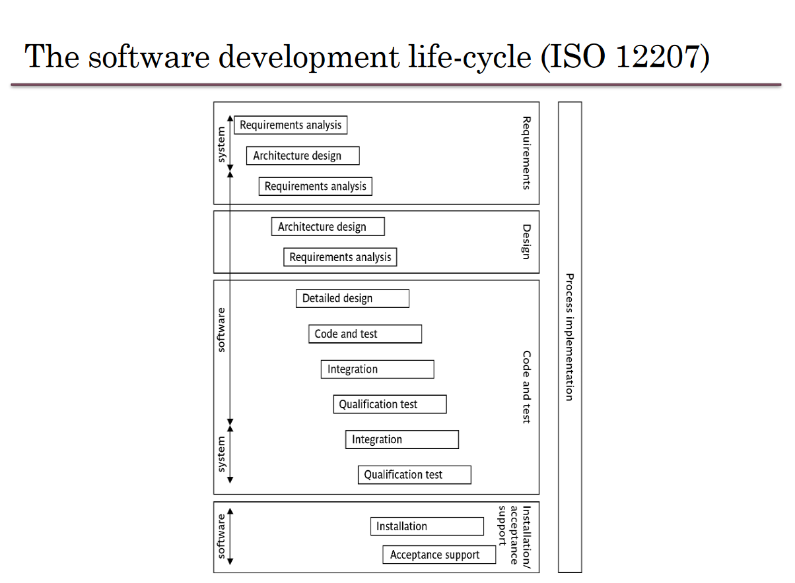

# Software Project Management (SOFE3490)

| Category                     | Mark   |
|------------------------------|--------|
| 5 Lab Assignments            | 15%    |
| Tutorials                    | 10%    |
| In-Class Activities/Quizzes  | 10%    |
| Midterm (Feb. 26th)          | 30%    |
| Final                        | 35%    |

Office Hours: Mondays 7-8 PM, SIRC 3386

**Quizzes:**
- Lockdown browser will be used in quizzes and must be done in class. 
- Expect a quiz bi-weekly. *(Lowest quiz mark dropped)*

**Midterm:**
- The exam will be on Feb. 26th during the class time. (**yes that means it's at 8pm**)
- No midterm deferral, marks will be added to the final exam

---

  
Lecture 1 | Introduction to SPM

  
    
  # Outline:
  *What is software project management?* Is it really different from *ordinary* project management?

  *How do you know when a project has been successful?* E.g., do the expectations of the customer/client match those of the developers?

  # Why is project management important?

  Large amounts of money are spent on Info & Comms. Technology (ICT).

  - Projects often fail; Standish Group claim only a third of ICT projects are successful. 82% were late and 43% exceeded their budget.
  - Poor project management is a major factor in these failures.

  # What is a project?

  The definition can vary, but its most important aspects are its *planning* and *size*.

  To compare:

  Jobs – repetition of very well-defined and well understood tasks with very little uncertainty
  Exploration – e.g. finding a cure for cancer: the outcome is very uncertain

  Projects lie in the middle between a job and exploration.

  A task is more 'project-like' if it is:
  - Non-routine
  - Planned
  - Aiming at a specific target
  - Carried out for a customer
  - Carried out by a temporary work group
  - Involving several specialisms
  - Made up of several different phases
  - Constrained by time and resources
  - Large and/or complex

  ## Exercise 1.1
  Which of the following is a project, a routine, or an exploration:
  

    
Producing an edition of a newspaper

  routine
  

  

    
Building the channel tunnel.

  project
  

  

    
Getting Married

  project

  

    
A research project into what makes a good human-computer interface.

  exploration
  

  

    
An investigation into the reason why a user has a problem with a computer system.

  project
  

  

    
A programming assignment for a second year computing student.

  project
  

  

    
Writing an operating system for a new computer

  exploration
  

  

    
Installing a new version of a word processing application in an organization

  routine
  

  Invisibility, Complexity, Conformity (compliance w/ standards, rules, or laws), and Flexibility make software more problematic to build than other engineered artefacts.

  Projects can be

  - **In-house:** clients & employers are employed by same organization
  - **Out-sourced:** clients & employers are employed by different organizations

  "Project manager" could be:
  - a ‘contract manager’ in the client organization
  - a technical project manager in the supplier/services organization

  ### Activities covered by project management
  Feasibility study
  - Is project technically feasible and worthwhile from a business point of view?

  Planning
  - Only done if project is feasible

  Execution
  - Implement plan, but plan may be changed as we go along

  ## The software development life-cycle
  

  # Plans, methods & methodologies
  

  ### Some ways of categorizing projects
  Distinguishing different types of project is important, as different types of task need different project approaches e.g.

  - **Voluntary** systems (such as computer games) versus **compulsory** systems e.g. the order processing system in an organization
  - **Information** systems versus **embedded** systems
  - **Objective-based** versus **product-based**

  ## Objective vs. Product-Driven

  Consider the following scenarios:
  - Is implementing a new pay-roll system an objective or product-driven project?
  - Implementing a new iPhone app?
  - Switching a database from DB2 to Oracle?

  ## Embedded Systems

  It includes:
  - ATM software
  - Car climate control
  - Car airbag, ABS, and cruise control systems

  # Stakeholders

  The people who have a stake or interest in the project, and can include _clients_ or _developers._ These include:

  - Internal project members
  - Organization members unrelated to project
  - Outside of organization

  Different stakeholders may have different objectives; must define common project objectives.

  

  

  # Setting Objectives

  Answering the question: "What do we have to do to have a success?"
  - Need for a **project authority**
    - Sets the project scope
    - Allocates/approves costs
  - Could be one person - _**or**_ a group
    - Project Board
    - Project Management Board
    - Steering committee
  
  ## Objectives

  Informally, the objective of a project can be defined by completing the following statement:

  _"The project will be regarded as a success if..."_

  Rather like _post-conditions_ for the project

  Focus on **what** will be put in place, **rather than how** activities will be carried out

  ### S.M.A.R.T.

  S – Specific: project is concrete and well-defined

  M – Measurable: satisfaction of the objective can be objectively judged

  A – Achievable: it is within the power of the individual or group concerned to meet the target

  R – Relevant: the objective must be relevant to the true purpose of the project

  T – Time-constrained: there is a defined point in time by which the objective should be achieved

  

  ### Goals/Sub-objectives

  Steps along the way to reach an objective. Informally, the following statement can be used to define a goal:

  "To reach objective X, the following must be in place:

  Goal A,

  Goal B,

  Goal C, etc..."

  A goal is often attributed to an individual, who may have the power to complete the goal, but not the objective itself necessarily. For example:

  - _Overall objective_ – user satisfaction with software product
  - _Analyst goal_ – accurate requirements
  - _Developer goal_ – reliable software

  # Measures of effectiveness

  **How do we know that the goal or objective has been achieved?**

  By a practical test, that can be objectively assessed.
  e.g. for user satisfaction with software product:
  - Repeat business – they buy further products from us
  - Number of complaints – if low, etc.

  

  

  ## Other success criteria

  These can relate to longer term, less directly tangible assets
  - Improved skill and knowledge
  - Creation of assets that can be used on future projects e.g. software libraries
  - Improved customer relationships that lead to repeat business

  # What is management?

  This involves the following activities:
  - **Planning** – deciding what is to be done
  - **Organizing** – making arrangements
  - **Staffing** – selecting the right people for the job
  - **Directing** – giving instructions
  - **Monitoring** – checking on progress
  - **Controlling** – taking action to remedy hold-ups
  - **Innovating** – coming up with solutions when problems emerge
  - **Representing** – liaising with clients, users,developers and other stakeholders

  ## Management Control
  

  **Data** – the raw details
    - _e.g. "6,000 documents processed at location X"_

  **Information** – the data is processed to produce something that is meaningful and useful
    - _e.g. "productivity is 100 documents a day"_
      
  **Comparison** with objectives/goals
    - _e.g. we will not meet target of processing all documents by 31st March_

  **Modelling** – working out the probable outcomes of various decisions
    - _e.g. if we employ two more staff at location X how quickly can we get the documents processed?_
    
  **Implementation** – carrying out the remedial actions that have been decided upon

  # Post-lecture Key Points

  Projects - Non-routine, uncertain in nature

  Projects have particular problems - e.g., lack of visibility

  Clear objectives which can be objectively assessed is essential.

  Projects are prone to external forces outside of human control; usually impossible to plan for.

  **_Communication is key._**
  

---

  
Lecture 2 | Software Project Evaluation, Program Management

  # Outline:
  - The business case for a project
  - Project portfolios
  - Project evaluation
    - cost-benefit analysis
    - cash flow increasing
  - Programme management
  - Benefits management

  # Business Case

  Provides a justification for starting a project. Should show that the benefits of the project's outcome exceed development, implementation, and operational costs. Needs to take into account business risks.

  1. Introduction/ background
  2. The proposed project
  3. The market
  4. Organizational and operational infrastructure
  5. The benefits
  6. Outline implementation plan
  7. Costs
  8. The financial case
  9. Risks
  10. Management plan

  ## Content of the business case

  **Introduction/background:** describes problem to be solved/opportunity to be exploited

  **The proposed project:** a brief outline of the project scope

  **The market:** the project could be to develop a new product (e.g. a new computer game). The likely demand for the product would need to be assessed.

  **Organizational and operational infrastructure**: How the organization would need to change. This would be important where a new information system application was being introduced
  
  **Benefits**: These should be expressed in financial terms where possible. In the end it is up to the client to assess these – as they are going to pay for the project.

  **Outline implementation plan:** how the project is going to be implemented. This should consider the disruption to an organization that a project might cause.
  
  **Costs:** the implementation plan will supply information to establish these
  
  **Financial analysis:** combines costs and benefit data to establish value of project

---

  
Lecture 3 | Project Planning

---

  
Lecture 4 | Project Approach Selection

---
