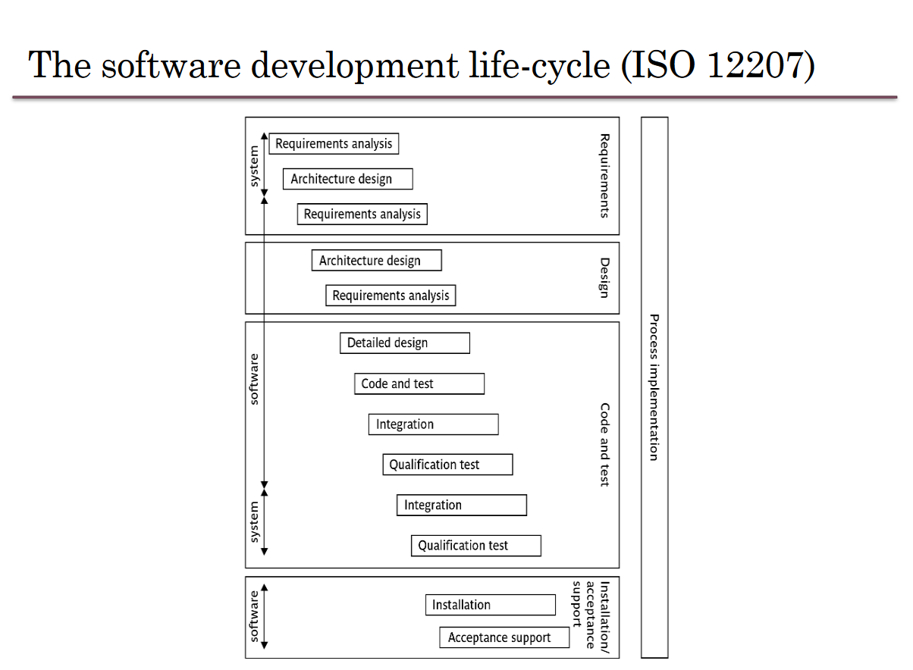

# Software Project Management (SOFE3490)

| Category                     | Mark   |
|------------------------------|--------|
| 5 Lab Assignments            | 15%    |
| Tutorials                    | 10%    |
| In-Class Activities/Quizzes  | 10%    |
| Midterm (Feb. 26th)          | 30%    |
| Final                        | 35%    |

Office Hours: Mondays 7-8 PM, SIRC 3386

**Quizzes:**
- Lockdown browser will be used in quizzes and must be done in class. 
- Expect a quiz bi-weekly. *(Lowest quiz mark dropped)*

**Midterm:**
- The exam will be on Feb. 26th during the class time. (**yes that means it's at 8pm**)
- No midterm deferral, marks will be added to the final exam

---

  
Lecture 5 | Software Effort Estimation

  
    
  # Outline:
  - Avoid the dangers of unrealistic estimates.
  - Understand the range of estimating methods that can be used
  - Estimate projects using a bottom-up approach
  - Count the function points and object points for a system
  - Estimate the effort needed to implement software using a procedural programming language
  - Understand the COCOMO approach
  
  # What makes a successful project?
- Delivering
- agreed functionality
- on time
- at the agreed cost
- with the required quality
- Stages:

1. set targets
2. Attempt to achieve targets

**BUT what if the targets are not achievable?**

  # Cost estimation model
- Cost estimation model is used to calculate the effort and schedule of a project.
- Cost estimation models give easy ways for reduce project risks and prepare plan for building the project.
- They are calculated using cost drivers.
- Cost drivers are critical features that have a direct impact on the project.

## Some problems with estimating
- Subjective nature of much of estimating
  - It may be difficult to produce evidence to support your precise target
- Political pressures
  - Managers may wish to reduce estimated costs in order to win support for acceptance of a project proposal
- Changing technologies
  - these bring uncertainties, especially in the early days when there is a ‘learning curve’
- Projects differ
  - Experience on one project may not be applicable to another
  
  
## Source Line of Code Technique (SLOC)
- The SLOC technique is an objective method of estimating or calculating the size of the project.
- The project size helps determine the resources, effort, cost, and duration required to complete the project.
- It is also used to directly calculate the effort to be spent on a project.
- We can use it when the programming language and the technology to be used are predefined.
- This technique includes the calculation of lines of codes (LOC), documentation of pages, inputs, outputs, and components of a software program.

## Exercise 5-1
- Calculate the productivity , SLOC per work month, of each of the projects in the following table, and also for the organization as a whole.
  
-  If the project leaders for projects “a” and “d” had correctly estimated the source number of lines of code (SLOC) and then used the average productivity of the organization to calculate the effort needed to complete the project, how far out would their estimate have been from the actual effort?

# Over and under-estimating
- Parkinson’s Law: ‘Work expands to fill the time available’
- Brook’s Law: putting more people on a late job makes is later!
- An over-estimate is likely to cause project to take longer than it would otherwise (i.e. Introducing and recruiting new people at the middle of the project)
- Weinberg’s Zeroth Law of reliability: ‘a software project that does not have to meet a reliability requirement can meet any other requirement’ (i.e. Under-estimated projects may not make it in time or budget but at least they are in a shorter time)

## An example of bad Estimate
- A project responsible to deliver a system for managing a lending process. It had an original estimation to finish in 9 months. Instead, it finished after 2 years. Clearly, in the eyes of the sponsor, stakeholders and steering committee, it was labeled a disaster. The worst part was that every time the team reported a status they asked only for 1 more month deadline extension. This presented, in their view, a realistic plan to finalize the scope. They worked an average of 12 hours a day, but the end result was a disappointment. The project for the next years became the benchmark of what could be done wrong.

- In another country of the same bank with almost the same project scope, they had an estimation of 3 years. They finished 2 months ahead of time and were praised for the achievement.

- Motivation and morale are enhanced where targets are achievable
- Several unsuccessful attempts and unattainable targets reduce motivation
- People claim the success but blame the organization for the failure

## Basis for successful estimating
- Information about past projects
  - Need to collect performance details about past project: how big were they? How much effort/time did they need?
- Need to be able to measure the amount of work involved
  - Traditional size measurement for software is ‘lines of code’ – but this can have problems
  - Discuss problems with SLOC and KLOC?

## A taxonomy of estimating methods
- Bottom-up - activity based, analytical
- Parametric or algorithmic models e.g. function points
- Expert opinion - just guessing?
- Analogy - case-based, comparative
- Parkinson and 'price to win'.

# Bottom-up versus top-down
- **Bottom-up**
  - identify all tasks that have to be done – so quite time-consuming
  - use when you have no data about similar past projects
  - First top-down (in task level), i.e. work breakdown schedule(WBS) and then bottom-up
- **Top-down**
  - produce overall estimate based on project cost drivers
  - based on past project data
  - divide overall estimate between jobs to be done

## Bottom-up estimating
1. Break project into smaller and smaller components
2. Stop when you get to what one person can do in one/two weeks
3. Estimate costs for the lowest level activities
4. At each higher level calculate estimate by adding estimates for lower levels
[If you have never done something before you can imagine what you could do in about a week.]

## Top-down estimating

# Algorithmic/Parametric models
- Constructive Cost Model (COCOMO) (lines of code) and function points examples of these
- In CoCoMo, the model parameters are derived from fitting a regression formula using data from historical projects

guess -> algorithm -> estimate

**but what is desired is**

system characteristic -> algorithm -> estimate

- The problems with COCOMO is that the input parameter for system size is an estimate of lines of code. This is going to have to be an estimate at the beginning of the project.
- Function points counts various features of the logical design of an information system and produces an index number which reflects the amount of information processing it will have to carry out. This can be crudely equated to the amount of code it will need.

## Parametric models - the need for historical data
- simplistic model for an estimate
  - estimated effort = (system size) / productivity
- For example:
  - system size = lines of code (estimated) productivity = lines of code per day (measured based on previous projects)
  - productivity = (system size) / effort
    - based on past projects
  - This is analogous to calculating speed from distance and time.

- Some models focus on task or system size e.g. **Function Points**
- FPs originally used to estimate Lines of Code, rather than effort

- Other models focus on productivity: e.g. COCOMO
- Lines of code (or FPs etc) an input

## COCOMO
- COCOMO originally was based on a size parameter of lines of code (actually ‘thousand of delivered source code instructions’ or KDSI).
- Newer versions recognize the use of functions points as a size measure, but convert them to a number called ‘equivalent lines of code’ (ELOC)
- Also known as the nominal estimate or nominal effort
- Based on person-month:

   E_i_ = _a_ * (KLOC)_b_

  - where _a_ and _b_ are constants and depend on the project type

### Project types

- **Organic projects:** Organization has a lot of experience doing such projects; requirements are less stringent (i.e. small, straightforward projects)
- **Semi-detatched projects:** Medium-size, more complex (i.e., OSes or compiler projects)
- **Embedded projects:** Stringent requirements, fairly complex, organization has little or no experience in the area.

COCOMO constants for different types of projects:

|Project Type|a|b|
|-|-|-|
|Organic|3.2|1.05|
|Semi-detatched|3.0|1.12|
|Embedded|2.8|1.20|

  

 
  
  

---

  
Lecture 6 | Activity Planning

  # Outline:
  - The business case for a project
  - Project portfolios
  - Project evaluation
    - cost-benefit analysis
    - cash flow increasing
  - Programme management
  - Benefits management

 

---

  
Lecture 7 | TBD

# 'Step Wise' - aspirations

- Practicality
  - tries to answer the question ‘what do I do now?’
- Scalability
  - useful for small project as well as large
- Range of application
- Accepted techniques
  - e.g. borrowed from PRINCE etc.
  - (PRINCE: Project in Controlled Environment)

# Project scenario 
- Brightmouth College currently has payroll processing carried out by a service company
- This is very expensive and does not allow detailed analysis of personnel data to be carried out
- Decision made to bring payroll ‘in-house’ by acquiring an ‘off-the-shelf’ application
- The use of the off-the-shelf system will require a new, internal, payroll office to be setup
- There will be a need to develop some software ‘add-ons’: one will take payroll data and combine it with time-table data to calculate the staff costs for each course run in the college
- The project manager is Brigette.

# Step 1: Establish project scope and objectives

- 1.1 Identify objectives and measures of effectiveness
  - 'how do we know if we have succeeded?'
- 1.2 Establish a project authority
  - 'who is the boss?'
- 1.3 Identify all stakeholders in the project and their interests
  - 'who will be affected/involved in the project?'
- 1.4 Modify objectives in the light of stakeholder analysis
  - 'do we need to do things to win over stakeholders?' Why?
- 1.5 Establish methods of communication with all parties
  - 'how do we keep in contact?'

## Scenario review
- Project authority
  - Brigette finds she has **two different clients** for the new system: the **finance department** and the **personnel** (HR) office. A vice principal agrees to be official client, and monthly meetings are chaired by the VP and attended by Brigette and the heads of finance and personnel
  - These meetings would also help overcome communication barriers

- Stakeholders
  - For example, personnel office (HR) would supply details of new staff, leavers and changes (e.g. promotions)
  - To motivate co-operation, Brigette might ensure new payroll system produces reports that are useful to personnel staff

# Step 2: Establish project infrastructure
- 2.1. Establish link between project and any strategic plan (such as enterprise architecture)
  - 'why did they want the project?'
- 2.2. Identify installation standards and procedures
  - 'what standards do we have to follow?'
- 2.3. Identify project team organization
  - 'where do I fit in?'

---

  
Lecture 8 | TBD

# Building versus buying software

We are concerned with choosing the right approach to a particular project: variously called technical planning, project analysis, methods engineering and methods tailoring

- In-house: often the methods to be used dictated by organizational standards
  - Developers and clients belong to same organization
- Suppliers: need for tailoring as different customers have different needs

## Some advantages of off-the-shelf (OTS) software
- Cheaper as supplier can spread development costs over a large number of customers
- Software already exists
  - Can be trialled by potential customer
  - No delay while software being developed
- Where there have been existing users, bugs are likely to have been found and eradicated

## Some possible disadvantages of off-the-shelf
- Customer will have same application as everyone else: no competitive advantage, but competitive advantage may come from the way application is used
- Customer may need to change the way they work in order to fit in with OTS application
- Customer does not own the code and cannot change it
- Danger of over-reliance on a single supplier
- Chapter 10: managing contracts for more detail

## Choosing Technologies
- An outcome of project analysis will be the selection of the most appropriate methodologies and technologies.
  - Methodologies include techniques like OO dev.
  - Structured systems analysis and design methodology (SSADM) is a set of standards for systems analysis and application design
- While technologies include mobile apps dev., use knowledge-base system tools, etc.

# Taking account of the characteristics of the project
- Some of the questions to be asked before starting with the project.
  - Is it data oriented and a control oriented system?
  - Will the software to be produced be a general package or application specific?
  - Is the system safety-critical?
  - What is the nature of the hardware/software environment in which the system will operate?
  
## General approach
- Look at risks and uncertainties e.g.
  - are requirement well understood?
  - are technologies to be used well understood?
    
- Look at the type of application being built e.g.
  - information system? embedded system?
    
- Clients’ own requirements
  - need to use a particular method

## Structure versus speed of delivery

### Structured approach
- Also called ‘heavyweight’ approaches
- Step-by-step methods where each step and intermediate product is carefully defined
- Emphasis on getting quality right first time
- Example: use of UML (Universal Modelling Language) and USDP (Unified Software Development Process)
- Future vision: Model-Driven Architecture (MDA). UML supplemented with Object Constraint Language, press the button and application code generated from the UML/OCL model

## Characteristics of the Unified Process
- Architecture Centric
  - architecture sits at the heart of the project team's efforts to shape the system
- Iterative and Incremental (see below)
- Consists of 4P’s(People, process, product, and project)
- Focus on Risk
  - requires the project team to focus on addressing the most critical risks early in the project life cycle

## Structured Approach Advantages vs. Disadvantages

| Advantage of Structured approach | Disadvantage of Structured approach |
|-|-|
| Resolve the project risks related with the changing requirements | Complex and disorganized development process |
| Integration requires less time as it is carried out through out the software development life cycle | Reusability is impossible to the project which incorporates new technology |
| Since the components are reusable, development phase consumes less time | Expect expert time members. |
| Focuses on accurate documentation, hence can be considered as a complete methodology | High expense can be involved in heavy documentation |
| | Issues may arise at the testing phase due to too many integrations |
| | Customers are not interested in this approach |

## Structure versus speed of delivery
- Agile methods
  - Emphasis on speed of delivery rather than documentation
- RAD (Rapid Application Development)
  - emphasized use of quickly developed prototypes
- JAD (Joint Application Development).
  - Requirements are identified and agreed in intensive workshops with users
  - Hot-houses

## Joint Application Development
Also known as Joint Application Design

- Used for requirement elicitation
- Group orientated
- Facilitated through workshop sessions

## JAD Team Roles
- Sponsor
  - One or more individuals
- Facilitator
  - There can be only one
- Participant
  - Multiple individuals based scope and complexity
- Scribe
  - Typically one individual

## What is Agile Methodology?
- It’s a philosophy that means breaking projects down into small goals and working towards those goals while adding new goals
  - Individuals and interactions over processes and tools
  - Working software over comprehensive documentation
  - Customer collaboration over contract negotiation
  - Responding to change over following a plan

# Process models

## Choice of process models
- 'Waterfall', also known as 'one-shot', 'once-through'
- Incremental delivery
- Evolutionary development

Also use of ‘agile methods’ e.g. extreme programming: mainly a particular way of carrying out incremental and evolutionary development

## Waterfall

Waterfall Advantages

- The 'classical' model
- Easy to understand and use
- Imposes structure on the project
- Works effectively once the requirements are well understood.
- Easy to manage, no overlaps in between phases
- Every stage needs to be checked and signed off
- V model approach is an extension of waterfall where different testing phases are identified which check the quality of different development phases (V model will be discussed in Chapter 13)

BUT
- limited scope for iteration

## Prototyping and iterative approaches

### Evolutionary Delivery: Prototyping

Major prototyping approaches:
- 'Throw away' prototypes
- Evolutionary prototypes

What is being prototyped?
- Human-computer interface
- Functionality 

### Reasons for Prototyping:
- learning by doing
- improved communication
- improved user involvement
- a feedback loop is established
- reduces the need for documentation
- reduces maintenance costs i.e. changes after the application goes live
- prototype can be used for producing expected results

### Prototyping: Some Dangers
- users may misunderstand the role of the prototype
- lack of project control and standards possible
- additional expense of building prototype
- focus on user-friendly interface could be at expense of machine efficiency

### Other ways of categorizing prototyping
- what is being learnt?
  - organizational prototype
  - hardware/software prototype ('experimental')
  - application prototype ('exploratory')
- to what extent
  - mock-ups
  - simulated interaction
  - partial working models: vertical versus horizontal

## Incremental delivery

### Incremental approach: benefits
- feedback from early stages used in developing latter stages
- shorter development thresholds: important when requirements are likely to change
- user gets some benefits earlier: may assist cash flow
- project may be put aside temporarily: more urgent jobs may emerge
- reduces ‘gold-plating’: features requested but not used 

### Incremental approach: disadvantages
- loss of economy of scale: some costs will be repeated
- 'software breakage': later increments might
- change earlier increments

### The outline incremental plan
- steps ideally 1% to 5% of the total project
- non-computer steps should be included
- ideal if a step takes one month or less:
  - not more than three months
- each step should deliver some benefit to the user
- some steps will be physically dependent on others

### Which step first?
- some steps will be pre-requisite because of physical dependencies
- others may be in any order
- value to cost ratios may be used
- V/C where
  - V is a score 1-10 representing value to customer
  - C is a score 0-10 representing cost to developers

### V/C ratios: an example
| step | value | cost | ratio | placement |
|-|-|-|-|-|
| profit reports | 9 | 1 | 9 | 2nd |
| online database | 1 | 9 | 0.11 | 5th |
| ad hoc enquiry | 5 | 5 | 1 | 4th |
| purchasing plans | 9 | 4 | 2.25 | 3rd |
| profit-based pay for managers | 9 | 0 | inf | 1st |

# Agile approaches
Structured development methods have some perceived advantages
- produce large amounts of documentation which can be largely unread
  - documentation has to be kept up to date
  - division into specialist groups and need to follow procedures stifles communication
  - users can be excluded from decision process
The answer? 'Agile' methods?

## Atern/Dynamic system development method (DSDM)
- UK-based consortium
- arguably DSDM can be seen as replacement for SSADM
- DSDM is more a project management approach than a development approach
- Can still use DFDs, LDSs etc!
- An update of DSDM has been badged as 'Atern'

## Six core Atern/DSDM principles
1. Focus on business need
2. Delivery on time – use of time-boxing
3. Collaborate
4. Never compromise quality
5. Deliver iteratively by using prototype
6. Build incrementally

## Atern DSDM: time-boxing
- time-box fixed deadline by which something has to be delivered
- typically two to six weeks
- MoSCoW priorities
  - Must have - essential
  - Should have - very important, but system could operate without
  - Could have
  - Want - but probably won’t get!
 
## Extreme programming
- increments of one to three weeks
- customer can suggest improvement at any point
- argued that distinction between design and building of software are artificial (face to face Communication)
- code to be developed to meet current needs only
- frequent re-factoring to keep code structured
- developers work in pairs
- test cases and expected results devised before software design
- after testing of increment, test cases added to a consolidated set of test cases

## Limitations of extreme programming
- Reliance on availability of high quality developers
- Dependence on personal knowledge – after development knowledge of software may decay making future development less easy
- Rationale for decisions may be lost e.g. which test case checks a particular requirement
- Reuse of existing code less likely

# 'rules of thumb' about approach to be used

- IF uncertainty is high
  - THEN use evolutionary approach
- IF complexity is high but uncertainty is not
  - THEN use incremental approach
- IF uncertainty and complexity both low
  - THEN use one-shot
- IF schedule is tight
  - THEN use evolutionary or incremental 

---
