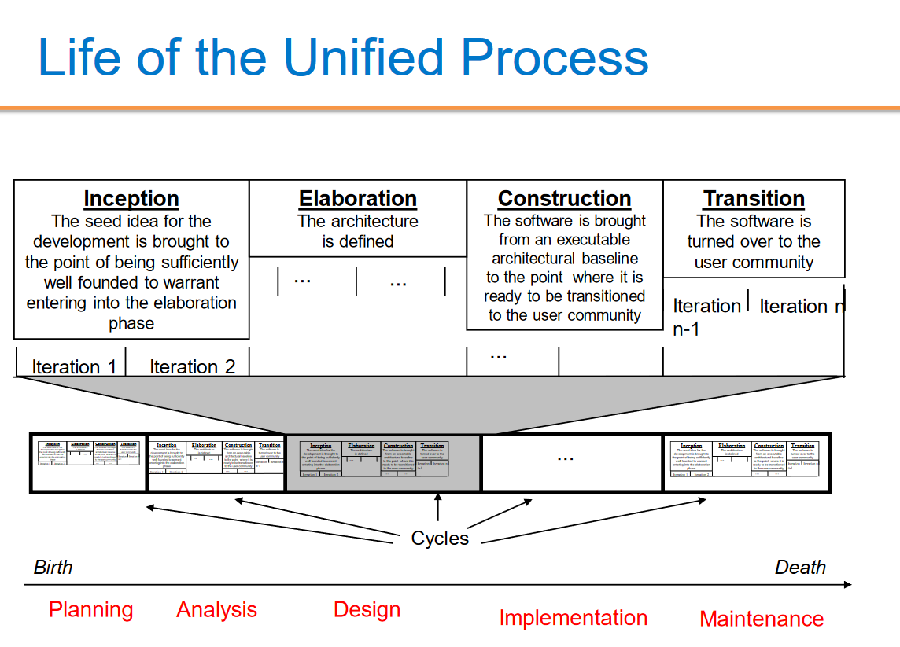
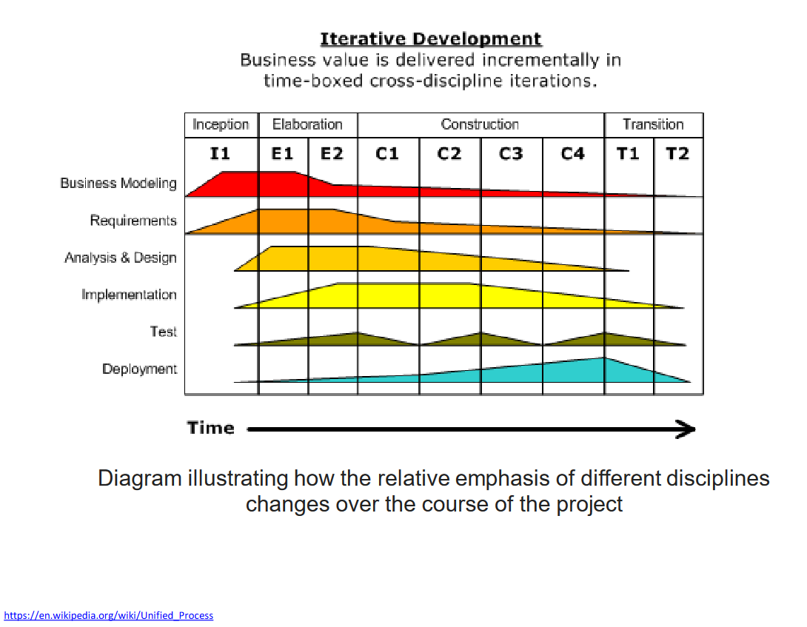

# Software Project Management (SOFE3490)

| Category                     | Mark   |
|------------------------------|--------|
| 5 Lab Assignments            | 15%    |
| Tutorials                    | 10%    |
| In-Class Activities/Quizzes  | 10%    |
| Midterm (Feb. 26th)          | 30%    |
| Final                        | 35%    |

Office Hours: Mondays 7-8 PM, SIRC 3386

**Quizzes:**
- Lockdown browser will be used in quizzes and must be done in class. 
- Expect a quiz bi-weekly. *(Lowest quiz mark dropped)*

**Midterm:**
- The exam will be on Feb. 26th during the class time. (**yes that means it's at 8pm**)
- No midterm deferral, marks will be added to the final exam

---

  
Lecture 5 | Software Effort Estimation

  
    
  # Outline:
  - Avoid the dangers of unrealistic estimates.
  - Understand the range of estimating methods that can be used
  - Estimate projects using a bottom-up approach
  - Count the function points and object points for a system
  - Estimate the effort needed to implement software using a procedural programming language
  - Understand the COCOMO approach
  
  # What makes a successful project?
- Delivering
- agreed functionality
- on time
- at the agreed cost
- with the required quality
- Stages:

1. set targets
2. Attempt to achieve targets

**BUT what if the targets are not achievable?**

  # Cost estimation model
- Cost estimation model is used to calculate the effort and schedule of a project.
- Cost estimation models give easy ways for reduce project risks and prepare plan for building the project.
- They are calculated using cost drivers.
- Cost drivers are critical features that have a direct impact on the project.

## Some problems with estimating
- Subjective nature of much of estimating
  - It may be difficult to produce evidence to support your precise target
- Political pressures
  - Managers may wish to reduce estimated costs in order to win support for acceptance of a project proposal
- Changing technologies
  - these bring uncertainties, especially in the early days when there is a ‘learning curve’
- Projects differ
  - Experience on one project may not be applicable to another
  
  
## Source Line of Code Technique (SLOC)
- The SLOC technique is an objective method of estimating or calculating the size of the project.
- The project size helps determine the resources, effort, cost, and duration required to complete the project.
- It is also used to directly calculate the effort to be spent on a project.
- We can use it when the programming language and the technology to be used are predefined.
- This technique includes the calculation of lines of codes (LOC), documentation of pages, inputs, outputs, and components of a software program.

## Exercise 5-1
- Calculate the productivity , SLOC per work month, of each of the projects in the following table, and also for the organization as a whole.
  
-  If the project leaders for projects “a” and “d” had correctly estimated the source number of lines of code (SLOC) and then used the average productivity of the organization to calculate the effort needed to complete the project, how far out would their estimate have been from the actual effort?

# Over and under-estimating
- Parkinson’s Law: ‘Work expands to fill the time available’
- Brook’s Law: putting more people on a late job makes is later!
- An over-estimate is likely to cause project to take longer than it would otherwise (i.e. Introducing and recruiting new people at the middle of the project)
- Weinberg’s Zeroth Law of reliability: ‘a software project that does not have to meet a reliability requirement can meet any other requirement’ (i.e. Under-estimated projects may not make it in time or budget but at least they are in a shorter time)

## An example of bad Estimate
- A project responsible to deliver a system for managing a lending process. It had an original estimation to finish in 9 months. Instead, it finished after 2 years. Clearly, in the eyes of the sponsor, stakeholders and steering committee, it was labeled a disaster. The worst part was that every time the team reported a status they asked only for 1 more month deadline extension. This presented, in their view, a realistic plan to finalize the scope. They worked an average of 12 hours a day, but the end result was a disappointment. The project for the next years became the benchmark of what could be done wrong.

- In another country of the same bank with almost the same project scope, they had an estimation of 3 years. They finished 2 months ahead of time and were praised for the achievement.

- Motivation and morale are enhanced where targets are achievable
- Several unsuccessful attempts and unattainable targets reduce motivation
- People claim the success but blame the organization for the failure

## Basis for successful estimating
- Information about past projects
  - Need to collect performance details about past project: how big were they? How much effort/time did they need?
- Need to be able to measure the amount of work involved
  - Traditional size measurement for software is ‘lines of code’ – but this can have problems
  - Discuss problems with SLOC and KLOC?

## A taxonomy of estimating methods
- Bottom-up - activity based, analytical
- Parametric or algorithmic models e.g. function points
- Expert opinion - just guessing?
- Analogy - case-based, comparative
- Parkinson and 'price to win'.

# Bottom-up versus top-down
- **Bottom-up**
  - identify all tasks that have to be done – so quite time-consuming
  - use when you have no data about similar past projects
  - First top-down (in task level), i.e. work breakdown schedule(WBS) and then bottom-up
- **Top-down**
  - produce overall estimate based on project cost drivers
  - based on past project data
  - divide overall estimate between jobs to be done

## Bottom-up estimating
1. Break project into smaller and smaller components
2. Stop when you get to what one person can do in one/two weeks
3. Estimate costs for the lowest level activities
4. At each higher level calculate estimate by adding estimates for lower levels
[If you have never done something before you can imagine what you could do in about a week.]

## Top-down estimating

# Algorithmic/Parametric models
- Constructive Cost Model (COCOMO) (lines of code) and function points examples of these
- In CoCoMo, the model parameters are derived from fitting a regression formula using data from historical projects

guess -> algorithm -> estimate

**but what is desired is**

system characteristic -> algorithm -> estimate

- The problems with COCOMO is that the input parameter for system size is an estimate of lines of code. This is going to have to be an estimate at the beginning of the project.
- Function points counts various features of the logical design of an information system and produces an index number which reflects the amount of information processing it will have to carry out. This can be crudely equated to the amount of code it will need.

## Parametric models - the need for historical data
- simplistic model for an estimate
  - estimated effort = (system size) / productivity
- For example:
  - system size = lines of code (estimated) productivity = lines of code per day (measured based on previous projects)
  - productivity = (system size) / effort
    - based on past projects
  - This is analogous to calculating speed from distance and time.

- Some models focus on task or system size e.g. **Function Points**
- FPs originally used to estimate Lines of Code, rather than effort

- Other models focus on productivity: e.g. COCOMO
- Lines of code (or FPs etc) an input

## COCOMO
- COCOMO originally was based on a size parameter of lines of code (actually ‘thousand of delivered source code instructions’ or KDSI).
- Newer versions recognize the use of functions points as a size measure, but convert them to a number called ‘equivalent lines of code’ (ELOC)
- Also known as the nominal estimate or nominal effort
- Based on person-month:

   E_i_ = _a_ * (KLOC)_b_

  - where _a_ and _b_ are constants and depend on the project type, and KLOC is lines of code (measured in thousands).

### Project types

- **Organic projects:** Organization has a lot of experience doing such projects; requirements are less stringent (i.e. small, straightforward projects)
- **Semi-detatched projects:** Medium-size, more complex (i.e., OSes or compiler projects)
- **Embedded projects:** Stringent requirements, fairly complex, organization has little or no experience in the area.

## COCOMO constants for different types of projects:

|Project Type|a|b|
|-|-|-|
|Organic|3.2|1.05|
|Semi-detatched|3.0|1.12|
|Embedded|2.8|1.20|

Ex: Software project with an estimated 8000 lines of code (LOC) and is considered organic has an initial effort calculated to be:

 E_i_ = 3.2 * (8)1.05

 = 28 person-months

Ex: Software project with an estimated 10000 lines of code (LOC) and is considered embedded has an initial effort calculated to be:

 E_i_ = 2.8 * (10)1.20

 = 44 person-months

## Cocomo Duration Estimation

**Formula for duration calculation:** D = _c_ * E_d_

- where _c_ and _d_ are constants and depend on the project type, and E is effort (formula above).

|Project Type  | c | d  |
|--------------|---|----|
| Organic      |2.5|0.38|
|Semi-detatched|2.5|0.35|
| Embedded     |2.5|0.32|

Ex: Software project with an estimated 20000 lines of code (LOC) and is considered organic has a duration calculated to be:

 E_i_ = 3.2 * (20)1.05

 = 74.34
 = 74-person months

 D = 2.5 * 740.38

 = 12.8
 = 13 months

# Expert judgement
- Asking someone who is familiar with and knowledgeable about the application area and the technologies to provide an estimate
- Particularly appropriate where existing code is to be modified
- Research shows that experts judgement in practice tends to be based on analogy

## Estimating by analogy

## Stages: identify
- Significant features of the current project
- previous project(s) with similar features
- differences between the current and previous projects
- possible reasons for error (risk)
- measures to reduce uncertainty

Euclidean distance = √( (It - Is)2 + (It - Os)2 )

# Function Points (FP)
- Measure the amount of functionality in a software application
- The large the number of function points, the more functionality
- Function points allow for scaling
- Measure the size of requirements

# Parametric models
We are now looking more closely at four parametric models:

1. Albrecht/IFPUG function points

2. Symons/Mark II function points

3. COSMIC function points

4. COCOMO81 and COCOMO II

Note: Recall that function points model system size, while COCOMO focuses on productivity factors.

## Albrecht/IFPUG function points
- Albrecht worked at IBM and needed a way of measuring the relative productivity of different programming languages.
- Needed some way of measuring the size of an application without counting lines of code.
- Identified five types of component or functionality in an information system
- Counted occurrences of each type of functionality in order to get an indication of the size of an information system

### Five function types
  1. Logical interface file (LIF) types – equates roughly to a data store in systems analysis terms. Created and accessed by the target system
  2. External interface file types (EIF) – where data is retrieved from a data store which is actually maintained by a different application.
  3. External input (EI) types – input transactions which update internal computer files
  4. External output (EO) types – transactions which extract and display data from internal computer files. Generally involves creating reports.
  5. External inquiry (EQ) types – user initiated transactions which provide information but do not update computer files. Normally the user inputs some data that guides the system to the information the user needs.

### Albrecht complexity multipliers
|External user types |Low complexity| Medium complexity| High complexity|
|-|-|-|-|
|EI| 3| 4| 6|
|EO| 4| 5| 7|
|EQ| 3| 4| 6|
|LIF| 7| 10| 15|
|EIF| 5| 7| 10|

### Examples
Payroll application has:
1. Transaction to input, amend and delete employee details – an EI that is rated of medium complexity
2. A transaction that calculates pay details from timesheet data that is input – an EI of high complexity
3. A transaction of medium complexity that prints out pay-to-date details for each employee – EO
4. A file of payroll details for each employee – assessed as of medium complexity LIF
5. A personnel file maintained by another system is accessed for name and address details – a simple EIF

What would be the FP counts for these?

FP counts
1. Medium EI 4 FPs
2. High complexity EI 6 FPs
3. Medium complexity EO 5 FPs
4. Medium complexity LIF 10 FPs
5. Simple EIF 5 FPs

Total 30 FPs

If previous projects delivered 5 FPs a day, implementing the above should take 30/5 = 6 days

### Development Effort Multipliers (DEM)

- According to COCOMO, the major productivity drivers include:
  - Product attributes: required reliability, database size, product complexity
  - Computer attributes: execution time constraints, storage constraints, virtual machine (VM) volatility
  - Personnel attributes: analyst capability, application experience, VM experience, programming language experience
  - Project attributes: modern programming practices, software tools, schedule constraints
    
## COCOMO II

- An updated version of COCOMO:
  - There are different COCOMO II models for estimating at the ‘early design’ stage and the ‘post architecture’ stage when the final system is implemented. We’ll look specifically at the first.
  - The core model is:
    pm = A(size)(sf) × (em1) × (em2) × (em3)...
    - **pm** = person months
    - **A** is 2.94
    - **size** is number of thousands of lines of code
    - **sf** is the scale factor
    - **em** is an effort multiplier

### COCOMO II Scale factor

- Based on five factors which appear to be particularly sensitive to system size
1. Precedentedness (PREC). Degree to which there are past examples that can be consulted
2. Development flexibility (FLEX). Degree of flexibility that exists when implementing the project
3. Architecture/risk resolution (RESL). Degree of uncertainty about requirements
4. Team cohesion (TEAM).
5. Process maturity (PMAT) could be assessed by CMMI

### COCOMO II Scale factor values
|Driver| Very low| Low| Nominal| High| Very high| Extra high|
|-|-|-|-|-|-|-|
|PREC| 6.20| 4.96| 3.72| 2.48| 1.24| 0.00|
|FLEX| 5.07| 4.05| 3.04| 2.03| 1.01| 0.00|
|RESL| 7.07| 5.65| 4.24| 2.83| 1.41| 0.00|
|TEAM| 5.48| 4.38| 3.29| 2.19| 1.10| 0.00|
|PMAT| 7.80| 6.24| 4.68| 3.12| 1.56| 0.00|

### Example of scale factor
-  A software development team is developing an application which is very similar to previous ones it has developed. PREC is very high (score 1.24).
-  A very precise software engineering document lays down very strict requirements. FLEX is very low (score 5.07).
-  The good news is that these tight requirements are unlikely to change (RESL is high with a score 2.83).
-  The team is tightly knit (TEAM has high score of 2.19), but processes are informal (so PMAT is low and scores 6.24)

### Scale factor calculation

The formula for sf is

sf = B + 0.01 × Σ scale factor values
i.e. sf = 0.91 + 0.01 × (1.24 + 5.07 + 2.83 + 2.19 + 6.24)

= 1.0857

If system contained 10 KLOC then estimate would be 2.94 x 101.0857 = 35.8 person months

Using exponentiation (‘to the power of’) adds disproportionately more to the estimates for larger applications

B: is constant set at 0.91

## Effort multipliers
As well as the scale factor effort multipliers are also assessed:

|Abbreviation|Function|
|-|-|
|RCPX| Product reliability and complexity|
|RUSE| Reuse required|
|PDIF| Platform difficulty|
|PERS| Personnel capability|
|PREX| Personal experience|
|FCIL| Facilities available|
|SCED| Schedule pressure|

**Table of effort multipliers**
||Extra low| Very low| Low| Nominal| High| Very high| Extra high|
|-|-|-|-|-|-|-|-|
|RCPX| 0.49| 0.60| 0.83| 1.00| 1.33| 1.91| 2.72|
|RUSE|     |     | 0.95| 1.00| 1.07| 1.15| 1.24|
|PDIF|     |     | 0.87| 1.00| 1.29| 1.81| 2.61|
|PERS| 2.12| 1.62| 1.26| 1.00| 0.83| 0.63| 0.50|
|PREX| 1.59| 1.33| 1.12| 1.00| 0.87| 0.74| 0.62|
|FCIL| 1.43| 1.30| 1.10| 1.00| 0.87| 0.73| 0.62|
|SCED|     | 1.43| 1.14| 1.00| 1.00| 1.00|     |

### Example
- Say that a new project is similar in most characteristics to those that an organization has been dealing for some time
- **except**
  - the software to be produced is exceptionally complex and will be used in a safety critical system.
  - The software will interface with a new operating system that is currently in beta status.
  - To deal with this the team allocated to the job are regarded as exceptionally good, but do not have a lot of experience on this type of software.
    
- RCPX very high 1.91
- PDIF very high 1.81
- PERS extra high 0.50
- PREX nominal 1.00
  
All other factors are nominal
Say estimate is 35.8 person months
With effort multipliers this becomes 35.8 x 1.91 x 1.81 x 0.5 = 61.9 person months

# Some conclusions: how to review estimates

**Ask the following questions about an estimate:**
- What are the task size drivers?
- What productivity rates have been used?
- Is there an example of a previous project of about the same size?
- Are there examples of where the productivity rates used have actually been found?

---

  
Lecture 6 | Activity Planning

  # Objectives:
  - Produce an activity plan for a project
  - Estimate the overall duration of a project
  - Create a critical path and precedence network for a project

# Scheduling
Time is nature's way of stopping everything happening at once.

Having:
- worked out a method of doing the project
- identified the tasks to be carried
- assessed the time needed to do each task
- need to allocate dates/times for the start and end of each activity

## Activity networks

These help us to:
- Assess the feasibility of the planned project completion date
- Identify when resources will need to be deployed to activities
- Calculate when costs will be incurred
- This helps the co-ordination and motivation of the project team

## Defining activities

Activity networks are based on some assumptions:
- A project is:
  - Composed of a number of activities
  - May start when at least one of its activities is ready to start
  - Completed when all its activities are completed

- An activity
  - Must have clearly defined start and end-points
  - Must have resource requirements that can be forecast: these are assumed to be constant throughout the project
  - Must have a duration that can be forecast
  - May be dependent on other activities being completed first (precedence networks)

1. Work-based: draw-up a Work Breakdown Structure listing the work items needed
2. Product-based approach
  - List the deliverable and intermediate products of project – product breakdown structure (PBS)
  - Identify the order in which products have to be created
  - Work out the activities needed to create the products

3. The IBM MITP approach suggested the following 5 levels:
  - Level 1: Project
  - Level 2: Deliverables
  - Level 3: Components – which are key work items needed to produce the deliverables
  - Level 4: Work packages: groups of tasks needed to produce the components
  - Level 5: Tasks

MITP: Managing the Implementation of the Total Project is IBM`s project management delivery method and is a key component of IBM`s UK Project

We have done two separate things using bar chart:
1. Sequencing: by considering dependencies between tasks
2. Scheduling: by considering the availability of developers and staff

The two are combined, but we would like to separate them, it is good especially for larger projects. This is why we introduce network planning models.

# Network Planning Models
- They model the project’s activities and their relationships as a network.
- In the network, time flows from left to right.
- Critical Path Method (CPM)
- Program Evaluation Review Technique (PERT).
- In industry, almost all network planning models are called CPM (Critical Path Method).

## PERT
- Program Evaluation and Review Technique
- PERT was devised to support the development of the Polaris missile in the late 1950’s.
- PERT (precedence approach) is an activity-on-node notation – the ‘nodes’ are the boxes which represent activities
- The original PERT is activity-on-arrow approach (like CPM).

## CPM
- Critical Path Method
- CPM was developed by Du Pont Chemical Company who published the method in 1958.
- CPM uses an activity-on-arrow notation where the arrows are the activities.

### Drawing up a PERT diagram
- No looping back is allowed – deal with iterations by hiding them within single activities
- milestones – ‘activities’, such as the start and end of the project, which indicate transition points. They have zero duration.

### Lagged activities
- Where there is a fixed delay between activities (e.g. seven days notice has to be given to users that a new release has been signed off and is to be installed.)

Acceptance testing (20 days) --(7 days)--> Install new release (1 day)

Types of links between activities
- Finish to start

- Finish to start: The following activity starts when the previous one has been finished
  - e.g. testing starts when coding has been completed

- Start to start/Finish to finish

- Start to start: When one activity starts another has to start as well
  - e.g. when prototype testing starts amendment documentation has to start as well

- Finish to finish: when one activity finishes the other must finish too
  - e.g. when the testing of the prototype is completed so is the documentation of any amendments
- You could use these with lags e.g. documentation of the changes to the prototype starts 1 day after the testing and finishes 2 days after testing has been completed

- Start to finish

- Start to finish – in the example when the cutover to the new system takes place, the operation of the temporary system is no longer needed. Although the cutover depends of the acceptance testing to be completed, the implication is that the cutover might not start straight after acceptance testing.

# Adding time to the network model: Start and finish times

- Activity ‘write report software’
- Earliest Start (ES)
- Earliest Finish (EF) = ES + duration
- Latest Finish (LF) = latest task can be completed without affecting project end
- Latest Start (LS) = LF - duration

## Example
- earliest start = day 5
- latest finish = day 30
- duration = 10 days

- earliest finish = ?
- latest start = ?

Float = LF - ES - duration

- The **earliest finish (EF)** would be day 5 plus 10 days i.e. day 15.
- The latest start (LS) would be day 30 – 10 days i.e. day 20
- The float would be 30 – 5 – 10 = 15 days
- This also is the same as LF – EF or LS - ES

‘Day 0’
- Note that in the last example, day numbers used rather than actual dates
- Makes initial calculations easier – not concerned with week-ends and public holidays
- For finish date/times Day 10 means at the END of Day 10.
- For a start date/time Day 1 also means at the END of Day 1.
- The first activity therefore begin at Day 0 i.e. the end of Day 0 i.e. the start of Day 1.

## 1. Forward pass
- Is carried out to calculate the earliest dates on which each activity may be started and completed
- Start at beginning (Day 0) and work forward following chains.
- Earliest start date for the current activity = earliest finish date for the previous
- When there is more than one previous activity, take the **latest** earliest finish

## 2. Backward pass
- Is to carry out a backward pass to calculate the latest date at which each activity may be started and finished without delaying the end date of the project.
- Start from the last activity
- We assume that the latest finish (LF) for the last activity = earliest finish (EF)
- work backwards
- Latest finish for current activity = Latest start for the previous activity
- More than one previous activity - take the earliest LS
- Latest start (LS) = LF for activity - duration

# Float
- Activity’s float (total float): the difference between activity earliest start and latest start (or earliest finish and latest finish)
- It is a measure of how much the start or completion of an activity may be delayed without affecting the end date of the project.

Float = Latest finish (LF) - Earliest start (ES) - Duration

- Free float: the time by which an activity may be delayed without affecting any subsequent activity
- Free float = EF(current activity) – ES(next activity)

-  Interfering float: the difference between total float and free float
-  Interfering float= Total float - free float

- **Total float** = LF – ES – duration (or LS-ES or LF-EF)
- **Free float** = ES for following activity – EF for the current
- **Interfering float** = total float – free float

# Critical path
- Any delay to any activity in the critical path will delay the completion of the project.
- Activities in the critical path needs more attention and monitoring
- If we want to deliver any project earlier we have to work on shortening the duration of activities in the critical path
- Note the path through network with zero floats
- Can there be more than one critical path?
- Yes, there could be more than one critical path if the two longest paths through the network were of equal length.
- Can there be no critical path?

---

  
Lecture 7 | Risk Management

# Outline
- Definition of ‘risk’ and ‘risk management’
- Some ways of categorizing risk
- Risk management
  - Risk identification – what are the risks to a project?
  - Risk analysis – which ones are really serious?
  - Risk planning – what shall we do?
  - Risk monitoring – has the planning worked?
- We will also look at PERT risk and critical chains
  - PERT: Program Evaluation Review Technique

# Some definitions of risk
- 'the chance of exposure to the adverse consequences of future events' - PRINCE2
- 'an uncertain event or condition that, if it occurs, has a positive or negative effect on a project’s objectives' - PM-BOK

- Risks relate to possible future problems, not current ones
- They involve a possible cause and its effect(s) e.g. developer leaves > task delayed

---

  
Lecture 8 | Resource Allocation (Under Construction)

# Building versus buying software

We are concerned with choosing the right approach to a particular project: variously called technical planning, project analysis, methods engineering and methods tailoring

- In-house: often the methods to be used dictated by organizational standards
  - Developers and clients belong to same organization
- Suppliers: need for tailoring as different customers have different needs

## Some advantages of off-the-shelf (OTS) software
- Cheaper as supplier can spread development costs over a large number of customers
- Software already exists
  - Can be trialled by potential customer
  - No delay while software being developed
- Where there have been existing users, bugs are likely to have been found and eradicated

## Some possible disadvantages of off-the-shelf
- Customer will have same application as everyone else: no competitive advantage, but competitive advantage may come from the way application is used
- Customer may need to change the way they work in order to fit in with OTS application
- Customer does not own the code and cannot change it
- Danger of over-reliance on a single supplier
- Chapter 10: managing contracts for more detail

## Choosing Technologies
- An outcome of project analysis will be the selection of the most appropriate methodologies and technologies.
  - Methodologies include techniques like OO dev.
  - Structured systems analysis and design methodology (SSADM) is a set of standards for systems analysis and application design
- While technologies include mobile apps dev., use knowledge-base system tools, etc.

# Taking account of the characteristics of the project
- Some of the questions to be asked before starting with the project.
  - Is it data oriented and a control oriented system?
  - Will the software to be produced be a general package or application specific?
  - Is the system safety-critical?
  - What is the nature of the hardware/software environment in which the system will operate?
  
## General approach
- Look at risks and uncertainties e.g.
  - are requirement well understood?
  - are technologies to be used well understood?
    
- Look at the type of application being built e.g.
  - information system? embedded system?
    
- Clients’ own requirements
  - need to use a particular method

## Structure versus speed of delivery

### Structured approach
- Also called ‘heavyweight’ approaches
- Step-by-step methods where each step and intermediate product is carefully defined
- Emphasis on getting quality right first time
- Example: use of UML (Universal Modelling Language) and USDP (Unified Software Development Process)
- Future vision: Model-Driven Architecture (MDA). UML supplemented with Object Constraint Language, press the button and application code generated from the UML/OCL model

## Characteristics of the Unified Process
- Architecture Centric
  - architecture sits at the heart of the project team's efforts to shape the system
- Iterative and Incremental (see below)
- Consists of 4P’s(People, process, product, and project)
- Focus on Risk
  - requires the project team to focus on addressing the most critical risks early in the project life cycle

## Structured Approach Advantages vs. Disadvantages

| Advantage of Structured approach | Disadvantage of Structured approach |
|-|-|
| Resolve the project risks related with the changing requirements | Complex and disorganized development process |
| Integration requires less time as it is carried out through out the software development life cycle | Reusability is impossible to the project which incorporates new technology |
| Since the components are reusable, development phase consumes less time | Expect expert time members. |
| Focuses on accurate documentation, hence can be considered as a complete methodology | High expense can be involved in heavy documentation |
| | Issues may arise at the testing phase due to too many integrations |
| | Customers are not interested in this approach |

## Structure versus speed of delivery
- Agile methods
  - Emphasis on speed of delivery rather than documentation
- RAD (Rapid Application Development)
  - emphasized use of quickly developed prototypes
- JAD (Joint Application Development).
  - Requirements are identified and agreed in intensive workshops with users
  - Hot-houses

## Joint Application Development
Also known as Joint Application Design

- Used for requirement elicitation
- Group orientated
- Facilitated through workshop sessions

## JAD Team Roles
- Sponsor
  - One or more individuals
- Facilitator
  - There can be only one
- Participant
  - Multiple individuals based scope and complexity
- Scribe
  - Typically one individual

## What is Agile Methodology?
- It’s a philosophy that means breaking projects down into small goals and working towards those goals while adding new goals
  - Individuals and interactions over processes and tools
  - Working software over comprehensive documentation
  - Customer collaboration over contract negotiation
  - Responding to change over following a plan

# Process models

## Choice of process models
- 'Waterfall', also known as 'one-shot', 'once-through'
- Incremental delivery
- Evolutionary development

Also use of ‘agile methods’ e.g. extreme programming: mainly a particular way of carrying out incremental and evolutionary development

## Waterfall

Waterfall Advantages

- The 'classical' model
- Easy to understand and use
- Imposes structure on the project
- Works effectively once the requirements are well understood.
- Easy to manage, no overlaps in between phases
- Every stage needs to be checked and signed off
- V model approach is an extension of waterfall where different testing phases are identified which check the quality of different development phases (V model will be discussed in Chapter 13)

BUT
- limited scope for iteration

## Prototyping and iterative approaches

### Evolutionary Delivery: Prototyping

Major prototyping approaches:
- 'Throw away' prototypes
- Evolutionary prototypes

What is being prototyped?
- Human-computer interface
- Functionality 

### Reasons for Prototyping:
- learning by doing
- improved communication
- improved user involvement
- a feedback loop is established
- reduces the need for documentation
- reduces maintenance costs i.e. changes after the application goes live
- prototype can be used for producing expected results

### Prototyping: Some Dangers
- users may misunderstand the role of the prototype
- lack of project control and standards possible
- additional expense of building prototype
- focus on user-friendly interface could be at expense of machine efficiency

### Other ways of categorizing prototyping
- what is being learnt?
  - organizational prototype
  - hardware/software prototype ('experimental')
  - application prototype ('exploratory')
- to what extent
  - mock-ups
  - simulated interaction
  - partial working models: vertical versus horizontal

## Incremental delivery

### Incremental approach: benefits
- feedback from early stages used in developing latter stages
- shorter development thresholds: important when requirements are likely to change
- user gets some benefits earlier: may assist cash flow
- project may be put aside temporarily: more urgent jobs may emerge
- reduces ‘gold-plating’: features requested but not used 

### Incremental approach: disadvantages
- loss of economy of scale: some costs will be repeated
- 'software breakage': later increments might
- change earlier increments

### The outline incremental plan
- steps ideally 1% to 5% of the total project
- non-computer steps should be included
- ideal if a step takes one month or less:
  - not more than three months
- each step should deliver some benefit to the user
- some steps will be physically dependent on others

### Which step first?
- some steps will be pre-requisite because of physical dependencies
- others may be in any order
- value to cost ratios may be used
- V/C where
  - V is a score 1-10 representing value to customer
  - C is a score 0-10 representing cost to developers

### V/C ratios: an example
| step | value | cost | ratio | placement |
|-|-|-|-|-|
| profit reports | 9 | 1 | 9 | 2nd |
| online database | 1 | 9 | 0.11 | 5th |
| ad hoc enquiry | 5 | 5 | 1 | 4th |
| purchasing plans | 9 | 4 | 2.25 | 3rd |
| profit-based pay for managers | 9 | 0 | inf | 1st |

# Agile approaches
Structured development methods have some perceived advantages
- produce large amounts of documentation which can be largely unread
  - documentation has to be kept up to date
  - division into specialist groups and need to follow procedures stifles communication
  - users can be excluded from decision process
The answer? 'Agile' methods?

## Atern/Dynamic system development method (DSDM)
- UK-based consortium
- arguably DSDM can be seen as replacement for SSADM
- DSDM is more a project management approach than a development approach
- Can still use DFDs, LDSs etc!
- An update of DSDM has been badged as 'Atern'

## Six core Atern/DSDM principles
1. Focus on business need
2. Delivery on time – use of time-boxing
3. Collaborate
4. Never compromise quality
5. Deliver iteratively by using prototype
6. Build incrementally

## Atern DSDM: time-boxing
- time-box fixed deadline by which something has to be delivered
- typically two to six weeks
- MoSCoW priorities
  - Must have - essential
  - Should have - very important, but system could operate without
  - Could have
  - Want - but probably won’t get!
 
## Extreme programming
- increments of one to three weeks
- customer can suggest improvement at any point
- argued that distinction between design and building of software are artificial (face to face Communication)
- code to be developed to meet current needs only
- frequent re-factoring to keep code structured
- developers work in pairs
- test cases and expected results devised before software design
- after testing of increment, test cases added to a consolidated set of test cases

## Limitations of extreme programming
- Reliance on availability of high quality developers
- Dependence on personal knowledge – after development knowledge of software may decay making future development less easy
- Rationale for decisions may be lost e.g. which test case checks a particular requirement
- Reuse of existing code less likely

# 'rules of thumb' about approach to be used

- IF uncertainty is high
  - THEN use evolutionary approach
- IF complexity is high but uncertainty is not
  - THEN use incremental approach
- IF uncertainty and complexity both low
  - THEN use one-shot
- IF schedule is tight
  - THEN use evolutionary or incremental 

---
