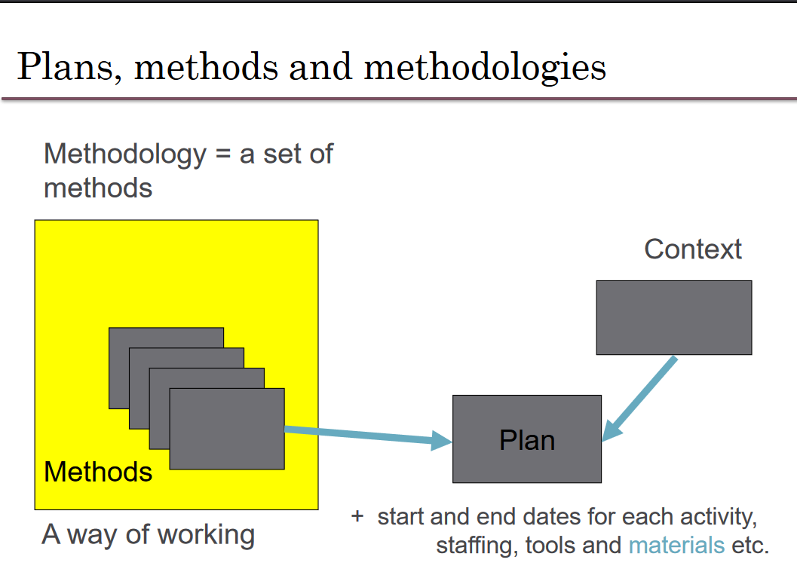
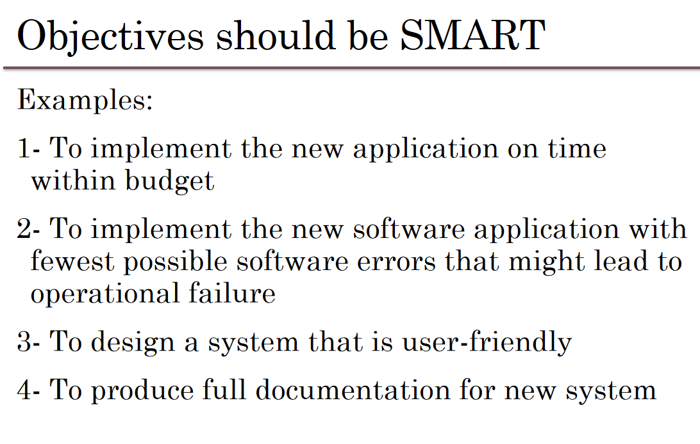
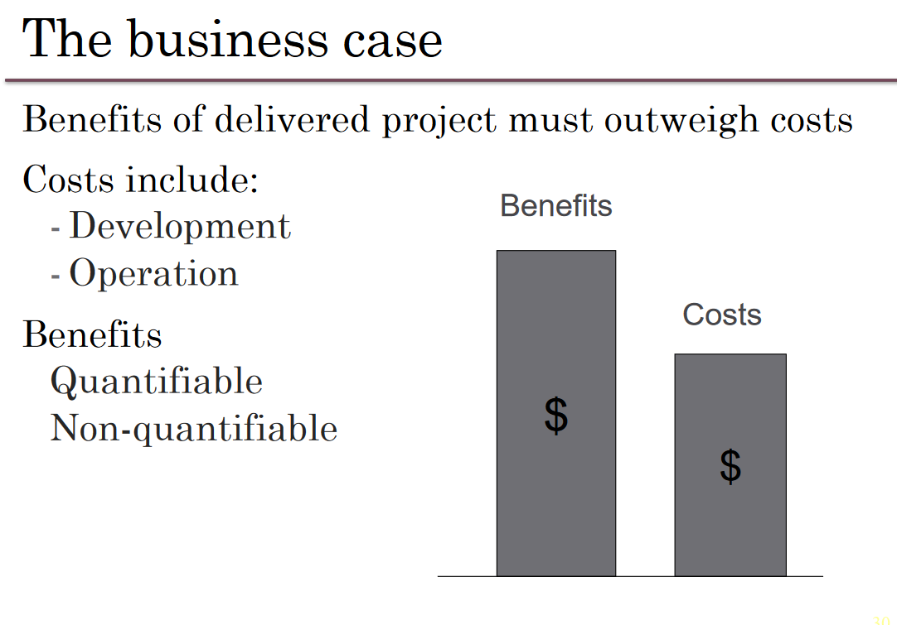
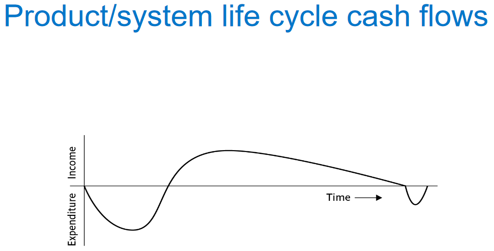
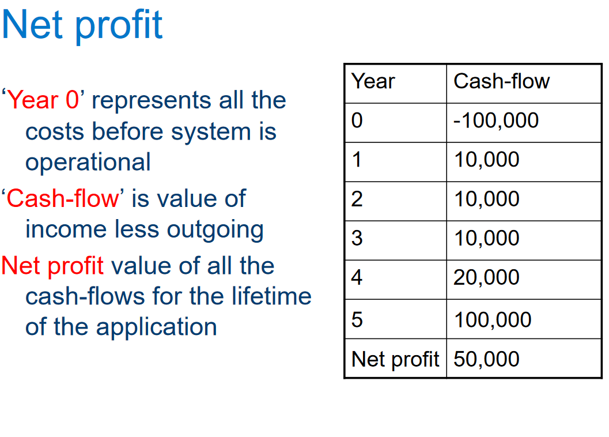

# Software Project Management (SOFE3490)

| Category                     | Mark   |
|------------------------------|--------|
| 5 Lab Assignments            | 15%    |
| Tutorials                    | 10%    |
| In-Class Activities/Quizzes  | 10%    |
| Midterm (Feb. 26th)          | 30%    |
| Final                        | 35%    |

Office Hours: Mondays 7-8 PM, SIRC 3386

**Quizzes:**
- Lockdown browser will be used in quizzes and must be done in class. 
- Expect a quiz bi-weekly. *(Lowest quiz mark dropped)*

**Midterm:**
- The exam will be on Feb. 26th during the class time. (**yes that means it's at 8pm**)
- No midterm deferral, marks will be added to the final exam

---

  
Lecture 5 | Software Effort Estimation

  
    
  # Outline:
  - Avoid the dangers of unrealistic estimates.
  - Understand the range of estimating methods that can be used
  - Estimate projects using a bottom-up approach
  - Count the function points and object points for a system
  - Estimate the effort needed to implement software using a procedural programming language
  - Understand the COCOMO approach
  
  # What makes a successful project?
- Delivering
- agreed functionality
- on time
- at the agreed cost
- with the required quality
- Stages:

1. set targets
2. Attempt to achieve targets

**BUT what if the targets are not achievable?**

  # Cost estimation model
- Cost estimation model is used to calculate the effort and schedule of a project.
- Cost estimation models give easy ways for reduce project risks and prepare plan for building the project.
- They are calculated using cost drivers.
- Cost drivers are critical features that have a direct impact on the project.

## Some problems with estimating
- Subjective nature of much of estimating
  - It may be difficult to produce evidence to support your precise target
- Political pressures
  - Managers may wish to reduce estimated costs in order to win support for acceptance of a project proposal
- Changing technologies
  - these bring uncertainties, especially in the early days when there is a ‘learning curve’
- Projects differ
  - Experience on one project may not be applicable to another
  
  
## Source Line of Code Technique (SLOC)
- The SLOC technique is an objective method of estimating or calculating the size of the project.
- The project size helps determine the resources, effort, cost, and duration required to complete the project.
- It is also used to directly calculate the effort to be spent on a project.
- We can use it when the programming language and the technology to be used are predefined.
- This technique includes the calculation of lines of codes (LOC), documentation of pages, inputs, outputs, and components of a software program.

## Exercise 5-1
- Calculate the productivity , SLOC per work month, of each of the projects in the following table, and also for the organization as a whole.
  
-  If the project leaders for projects “a” and “d” had correctly estimated the source number of lines of code (SLOC) and then used the average productivity of the organization to calculate the effort needed to complete the project, how far out would their estimate have been from the actual effort?

# Over and under-estimating
- Parkinson’s Law: ‘Work expands to fill the time available’
- Brook’s Law: putting more people on a late job makes is later!
- An over-estimate is likely to cause project to take longer than it would otherwise (i.e. Introducing and recruiting new people at the middle of the project)
- Weinberg’s Zeroth Law of reliability: ‘a software project that does not have to meet a reliability requirement can meet any other requirement’ (i.e. Under-estimated projects may not make it in time or budget but at least they are in a shorter time)

## An example of bad Estimate
- A project responsible to deliver a system for managing a lending process. It had an original estimation to finish in 9 months. Instead, it finished after 2 years. Clearly, in the eyes of the sponsor, stakeholders and steering committee, it was labeled a disaster. The worst part was that every time the team reported a status they asked only for 1 more month deadline extension. This presented, in their view, a realistic plan to finalize the scope. They worked an average of 12 hours a day, but the end result was a disappointment. The project for the next years became the benchmark of what could be done wrong.

- In another country of the same bank with almost the same project scope, they had an estimation of 3 years. They finished 2 months ahead of time and were praised for the achievement.

 
  - Carried out for a customer
  - Carried out by a temporary work group
  - Involving several specialisms
  - Made up of several different phases
  - Constrained by time and resources
  - Large and/or complex

  ## Exercise 1.1
  Which of the following is a project, a routine, or an exploration:
  

    
Producing an edition of a newspaper

  routine
  

  

    
Building the channel tunnel.

  project
  

  

    
Getting Married

  project

  

    
A research project into what makes a good human-computer interface.

  exploration
  

  

    
An investigation into the reason why a user has a problem with a computer system.

  project
  

  

    
A programming assignment for a second year computing student.

  project
  

  

    
Writing an operating system for a new computer

  exploration
  

  

    
Installing a new version of a word processing application in an organization

  routine
  

  Invisibility, Complexity, Conformity (compliance w/ standards, rules, or laws), and Flexibility make software more problematic to build than other engineered artefacts.

  Projects can be

  - **In-house:** clients & employers are employed by same organization
  - **Out-sourced:** clients & employers are employed by different organizations

  "Project manager" could be:
  - a ‘contract manager’ in the client organization
  - a technical project manager in the supplier/services organization

  ### Activities covered by project management
  Feasibility study
  - Is project technically feasible and worthwhile from a business point of view?

  Planning
  - Only done if project is feasible

  Execution
  - Implement plan, but plan may be changed as we go along

  ## The software development life-cycle
  

  # Plans, methods & methodologies
  

  ### Some ways of categorizing projects
  Distinguishing different types of project is important, as different types of task need different project approaches e.g.

  - **Voluntary** systems (such as computer games) versus **compulsory** systems e.g. the order processing system in an organization
  - **Information** systems versus **embedded** systems
  - **Objective-based** versus **product-based**

  ## Objective vs. Product-Driven

  Consider the following scenarios:
  - Is implementing a new pay-roll system an objective or product-driven project?
  - Implementing a new iPhone app?
  - Switching a database from DB2 to Oracle?

  ## Embedded Systems

  It includes:
  - ATM software
  - Car climate control
  - Car airbag, ABS, and cruise control systems

  # Stakeholders

  The people who have a stake or interest in the project, and can include _clients_ or _developers._ These include:

  - Internal project members
  - Organization members unrelated to project
  - Outside of organization

  Different stakeholders may have different objectives; must define common project objectives.

  

  

  # Setting Objectives

  Answering the question: "What do we have to do to have a success?"
  - Need for a **project authority**
    - Sets the project scope
    - Allocates/approves costs
  - Could be one person - _**or**_ a group
    - Project Board
    - Project Management Board
    - Steering committee
  
  ## Objectives

  Informally, the objective of a project can be defined by completing the following statement:

  _"The project will be regarded as a success if..."_

  Rather like _post-conditions_ for the project

  Focus on **what** will be put in place, **rather than how** activities will be carried out

  ### S.M.A.R.T.

  S – Specific: project is concrete and well-defined

  M – Measurable: satisfaction of the objective can be objectively judged

  A – Achievable: it is within the power of the individual or group concerned to meet the target

  R – Relevant: the objective must be relevant to the true purpose of the project

  T – Time-constrained: there is a defined point in time by which the objective should be achieved

  

  ### Goals/Sub-objectives

  Steps along the way to reach an objective. Informally, the following statement can be used to define a goal:

  "To reach objective X, the following must be in place:

  Goal A,

  Goal B,

  Goal C, etc..."

  A goal is often attributed to an individual, who may have the power to complete the goal, but not the objective itself necessarily. For example:

  - _Overall objective_ – user satisfaction with software product
  - _Analyst goal_ – accurate requirements
  - _Developer goal_ – reliable software

  # Measures of effectiveness

  **How do we know that the goal or objective has been achieved?**

  By a practical test, that can be objectively assessed.
  e.g. for user satisfaction with software product:
  - Repeat business – they buy further products from us
  - Number of complaints – if low, etc.

  

  

  ## Other success criteria

  These can relate to longer term, less directly tangible assets
  - Improved skill and knowledge
  - Creation of assets that can be used on future projects e.g. software libraries
  - Improved customer relationships that lead to repeat business

  # What is management?

  This involves the following activities:
  - **Planning** – deciding what is to be done
  - **Organizing** – making arrangements
  - **Staffing** – selecting the right people for the job
  - **Directing** – giving instructions
  - **Monitoring** – checking on progress
  - **Controlling** – taking action to remedy hold-ups
  - **Innovating** – coming up with solutions when problems emerge
  - **Representing** – liaising with clients, users,developers and other stakeholders

  ## Management Control
  

  **Data** – the raw details
    - _e.g. "6,000 documents processed at location X"_

  **Information** – the data is processed to produce something that is meaningful and useful
    - _e.g. "productivity is 100 documents a day"_
      
  **Comparison** with objectives/goals
    - _e.g. we will not meet target of processing all documents by 31st March_

  **Modelling** – working out the probable outcomes of various decisions
    - _e.g. if we employ two more staff at location X how quickly can we get the documents processed?_
    
  **Implementation** – carrying out the remedial actions that have been decided upon

  # Post-lecture Key Points

  Projects - Non-routine, uncertain in nature

  Projects have particular problems - e.g., lack of visibility

  Clear objectives which can be objectively assessed is essential.

  Projects are prone to external forces outside of human control; usually impossible to plan for.

  **_Communication is key._**
  

---

  
Lecture 6 | Activity Planning

  # Outline:
  - The business case for a project
  - Project portfolios
  - Project evaluation
    - cost-benefit analysis
    - cash flow increasing
  - Programme management
  - Benefits management

  # Business Case

  Provides a justification for starting a project. Should show that the benefits of the project's outcome exceed development, implementation, and operational costs. Needs to take into account business risks.

  1. Introduction/ background
  2. The proposed project
  3. The market
  4. Organizational and operational infrastructure
  5. The benefits
  6. Outline implementation plan
  7. Costs
  8. The financial case
  9. Risks
  10. Management plan

  ## Content of the business case

  **Introduction/background:** describes problem to be solved/opportunity to be exploited

  **The proposed project:** a brief outline of the project scope

  **The market:** the project could be to develop a new product (e.g. a new computer game). The likely demand for the product would need to be assessed.

  **Organizational and operational infrastructure**: How the organization would need to change. This would be important where a new information system application was being introduced
  
  **Benefits**: These should be expressed in financial terms where possible. In the end it is up to the client to assess these – as they are going to pay for the project.

  **Outline implementation plan:** how the project is going to be implemented. This should consider the disruption to an organization that a project might cause.
  
  **Costs:** the implementation plan will supply information to establish these
  
  **Financial analysis:** combines costs and benefit data to establish value of project

# Project portfolio management

The concerns of project portfolio management include:
- Evaluating proposals for projects
- Assessing the risk involved with projects
- Deciding how to share resources between projects
- Taking account of dependencies between projects
- Removing duplication between projects
- Checking for gaps

## Three Elements to PPM:

1. Project portfolio definition
  - Create a central record of all projects within an organization
  - Must decide whether to have ALL projects in the repository or, say, only ICT projects
  - Note difference between new product development (NPD) projects and renewal projects e.g. for process improvement

2. Project portfolio management
  - Actual costing and performance of projects can be recorded and assessed

3. Project portfolio optimization
  - Information gathered above can be used to achieve better balance of projects e.g. some that are risky but potentially very valuable balanced by less risky but less valuable projects

You may want to allow some work to be done outside the portfolio e.g. quick fixes

# Cost-benefit analysis (CBA)

This relates to an individual project. One must identify all the costs, which could be:
- Development costs
- Set-up
- Operational costs

One should also identify the value of benefits, and check if the benefits are greater than the costs

# Product/system life cycle cash flows

- The timing of costs and income for a product of system needs to be estimated.
- The development of the project will incur costs.
- When the system or product is released it will generate income that gradually pays off costs
- Some costs may relate to decommissioning – think of demolishing a nuclear power station.

# Pay back period

## Net present value
- NPV is the difference between the present value of cash inflows and the present value of cash outflows over time.
- Would you rather I gave you £100 today or in 12 months time?
- If I gave you £100 now you could put it in savings account and get interest on it.
- If the interest rate was 10% how much would I have to invest now to get £100 in a year’s time?
- This figure is the net present value of £100 in one year’s time

100/(1+0.1)= $91

## Discount factor
- Discount factor = 1/(1+r)t, r is the interest rate or discount rate (e.g. 10% is 0.10) (t) is the number of years
- In the case of 10% rate and one year
  - Discount factor = 1/(1+0.10) = 0.9091
- In the case of 10% rate and two years
  - Discount factor = 1/(1.10 x 1.10) =0.8294
 

The figure of $618 means that $618 more would be made than if the money were simply invested at 10%. An NPV of £0 would be the same amount of profit as would be generated by investing at 10%.

## Internal rate of return IRR
- NPV is to compare profitability of two or more projects but it is unable to compare profitability of a project with other forms of investment
- Internal rate of return (IRR) is the discount rate that would produce an NPV of 0 for the project
- Can be used to compare different investment opportunities

## Are NPV and IRR Enough?
- NPV and IRR cannot give a final answer to economic project evaluation:
  - Are we able to repay the interest on any borrowed money at appropriate time?
  - Future earning from a risky project might be far less reliable than earning from investing with a bank.
  - Projects might have financial dependency and impact: if we fund this project, will we also be able to fund other worthy projects?

# Dealing with uncertainty: Risk evaluation
- Every project involves risk
- What is risk:
  - Risk is the potential that a chosen action or activity will lead to a loss (an undesirable outcome).
  - The ISO 31000 (2009) definition of risk: The 'effect of uncertainty on objectives'. In this definition, uncertainties include events (which may or not happen) and uncertainties caused by ambiguity or a lack of information

- Project A might appear to give a better return than B but could be riskier
- **Project risk matrix** for each project to assess risks
- Using same risk factors, two or more projects can be compared using Project Risk Matrix
- For riskier projects could use higher discount rates

## Decision trees
We extend. Why?
- Extend branch:
  - 0.2*(-100,000)+0.8*75,000=40,000
- Replace branch:
  - 0.2*250,000+0.8*(-50,000)=10,000

## Programme management
- Program: a group of co-managed projects
- One definition: "a group of projects that are managed in a co-ordinated way to gain benefits that would not be possible were the projects to be managed independently"

### Programmes may be

**Strategic**:
- Several projects together can implement a single strategy: merging IS of two organizations

**Business cycle programmes**:
- A portfolio of project that are to take place within a certain time frame e.g. the next financial year

**Infrastructure programmes**:
- In an organization there may be many different ICT-based applications which share the same hardware/software infrastructure

**Research and development programmes**:
- In a very innovative environment where new products are being developed, a range of products could be developed some of which are very speculative and high-risk but potentially very profitable and some will have a lower risk but will return a lower profit. Getting the right balance would be key to the organization’s long term success.

**Innovative partnerships**:
- Pre-competitive co-operation to develop new technologies that could be exploited by a whole range of companies

### Strategic programmes 
- Based on OGC approach
- Initial planning document is the Programme Mandate describing
  - The new services/capabilities that the programme should deliver
  - How an organization will be improved
  – Fit with existing organizational goals
- A programme director appointed a champion for the scheme

### Next stages/documents
- **The programme brief** – equivalent of a feasibility study: emphasis on costs and benefits
- **The vision statement** – explains the new capability that the organization will have
- **The blueprint** – explains the changes to be made to obtain the new capability

# Benefits management

To carry this out, you must:
- Define expected benefits
- Analyse balance between costs and benefits
- Plan how benefits will be achieved
- Allocate responsibilities for their achievement
- Monitor achievement of benefits

## Benefits

These might include:
- Mandatory requirement
- Improved quality of service
- Increased productivity
- More motivated workforce
- Internal management benefits
- Risk reduction
- Economies
- Revenue enhancement/acceleration
- Strategic fit

## Quantifying benefits

Benefits can be:
- Quantified and valued e.g. a reduction of x staff saving £y
- Quantified but not valued e.g. a decrease in customer complaints by x%
- Identified but not easily quantified – e.g. public approval for a organization in the locality where it is based

# Closing remarks
- A project may fail not through poor management but because it should never have been started
- A project may make a profit, but it may be possible to do something else that makes even more profit
- A real problem is that it is often not possible to express benefits in accurate financial terms
- Projects with the highest potential returns are often the most risky

---

  
Lecture 3 | Step Wise: An approach to planning software projects

# 'Step Wise' - aspirations

- Practicality
  - tries to answer the question ‘what do I do now?’
- Scalability
  - useful for small project as well as large
- Range of application
- Accepted techniques
  - e.g. borrowed from PRINCE etc.
  - (PRINCE: Project in Controlled Environment)

# Project scenario 
- Brightmouth College currently has payroll processing carried out by a service company
- This is very expensive and does not allow detailed analysis of personnel data to be carried out
- Decision made to bring payroll ‘in-house’ by acquiring an ‘off-the-shelf’ application
- The use of the off-the-shelf system will require a new, internal, payroll office to be setup
- There will be a need to develop some software ‘add-ons’: one will take payroll data and combine it with time-table data to calculate the staff costs for each course run in the college
- The project manager is Brigette.

# Step 1: Establish project scope and objectives

- 1.1 Identify objectives and measures of effectiveness
  - 'how do we know if we have succeeded?'
- 1.2 Establish a project authority
  - 'who is the boss?'
- 1.3 Identify all stakeholders in the project and their interests
  - 'who will be affected/involved in the project?'
- 1.4 Modify objectives in the light of stakeholder analysis
  - 'do we need to do things to win over stakeholders?' Why?
- 1.5 Establish methods of communication with all parties
  - 'how do we keep in contact?'

## Scenario review
- Project authority
  - Brigette finds she has **two different clients** for the new system: the **finance department** and the **personnel** (HR) office. A vice principal agrees to be official client, and monthly meetings are chaired by the VP and attended by Brigette and the heads of finance and personnel
  - These meetings would also help overcome communication barriers

- Stakeholders
  - For example, personnel office (HR) would supply details of new staff, leavers and changes (e.g. promotions)
  - To motivate co-operation, Brigette might ensure new payroll system produces reports that are useful to personnel staff

# Step 2: Establish project infrastructure
- 2.1. Establish link between project and any strategic plan (such as enterprise architecture)
  - 'why did they want the project?'
- 2.2. Identify installation standards and procedures
  - 'what standards do we have to follow?'
- 2.3. Identify project team organization
  - 'where do I fit in?'

---

  
Lecture 4 | Project Approach Selection

# Building versus buying software

We are concerned with choosing the right approach to a particular project: variously called technical planning, project analysis, methods engineering and methods tailoring

- In-house: often the methods to be used dictated by organizational standards
  - Developers and clients belong to same organization
- Suppliers: need for tailoring as different customers have different needs

## Some advantages of off-the-shelf (OTS) software
- Cheaper as supplier can spread development costs over a large number of customers
- Software already exists
  - Can be trialled by potential customer
  - No delay while software being developed
- Where there have been existing users, bugs are likely to have been found and eradicated

## Some possible disadvantages of off-the-shelf
- Customer will have same application as everyone else: no competitive advantage, but competitive advantage may come from the way application is used
- Customer may need to change the way they work in order to fit in with OTS application
- Customer does not own the code and cannot change it
- Danger of over-reliance on a single supplier
- Chapter 10: managing contracts for more detail

## Choosing Technologies
- An outcome of project analysis will be the selection of the most appropriate methodologies and technologies.
  - Methodologies include techniques like OO dev.
  - Structured systems analysis and design methodology (SSADM) is a set of standards for systems analysis and application design
- While technologies include mobile apps dev., use knowledge-base system tools, etc.

# Taking account of the characteristics of the project
- Some of the questions to be asked before starting with the project.
  - Is it data oriented and a control oriented system?
  - Will the software to be produced be a general package or application specific?
  - Is the system safety-critical?
  - What is the nature of the hardware/software environment in which the system will operate?
  
## General approach
- Look at risks and uncertainties e.g.
  - are requirement well understood?
  - are technologies to be used well understood?
    
- Look at the type of application being built e.g.
  - information system? embedded system?
    
- Clients’ own requirements
  - need to use a particular method

## Structure versus speed of delivery

### Structured approach
- Also called ‘heavyweight’ approaches
- Step-by-step methods where each step and intermediate product is carefully defined
- Emphasis on getting quality right first time
- Example: use of UML (Universal Modelling Language) and USDP (Unified Software Development Process)
- Future vision: Model-Driven Architecture (MDA). UML supplemented with Object Constraint Language, press the button and application code generated from the UML/OCL model

## Characteristics of the Unified Process
- Architecture Centric
  - architecture sits at the heart of the project team's efforts to shape the system
- Iterative and Incremental (see below)
- Consists of 4P’s(People, process, product, and project)
- Focus on Risk
  - requires the project team to focus on addressing the most critical risks early in the project life cycle

## Structured Approach Advantages vs. Disadvantages

| Advantage of Structured approach | Disadvantage of Structured approach |
|-|-|
| Resolve the project risks related with the changing requirements | Complex and disorganized development process |
| Integration requires less time as it is carried out through out the software development life cycle | Reusability is impossible to the project which incorporates new technology |
| Since the components are reusable, development phase consumes less time | Expect expert time members. |
| Focuses on accurate documentation, hence can be considered as a complete methodology | High expense can be involved in heavy documentation |
| | Issues may arise at the testing phase due to too many integrations |
| | Customers are not interested in this approach |

## Structure versus speed of delivery
- Agile methods
  - Emphasis on speed of delivery rather than documentation
- RAD (Rapid Application Development)
  - emphasized use of quickly developed prototypes
- JAD (Joint Application Development).
  - Requirements are identified and agreed in intensive workshops with users
  - Hot-houses

## Joint Application Development
Also known as Joint Application Design

- Used for requirement elicitation
- Group orientated
- Facilitated through workshop sessions

## JAD Team Roles
- Sponsor
  - One or more individuals
- Facilitator
  - There can be only one
- Participant
  - Multiple individuals based scope and complexity
- Scribe
  - Typically one individual

## What is Agile Methodology?
- It’s a philosophy that means breaking projects down into small goals and working towards those goals while adding new goals
  - Individuals and interactions over processes and tools
  - Working software over comprehensive documentation
  - Customer collaboration over contract negotiation
  - Responding to change over following a plan

# Process models

## Choice of process models
- 'Waterfall', also known as 'one-shot', 'once-through'
- Incremental delivery
- Evolutionary development

Also use of ‘agile methods’ e.g. extreme programming: mainly a particular way of carrying out incremental and evolutionary development

## Waterfall

Waterfall Advantages

- The 'classical' model
- Easy to understand and use
- Imposes structure on the project
- Works effectively once the requirements are well understood.
- Easy to manage, no overlaps in between phases
- Every stage needs to be checked and signed off
- V model approach is an extension of waterfall where different testing phases are identified which check the quality of different development phases (V model will be discussed in Chapter 13)

BUT
- limited scope for iteration

## Prototyping and iterative approaches

### Evolutionary Delivery: Prototyping

Major prototyping approaches:
- 'Throw away' prototypes
- Evolutionary prototypes

What is being prototyped?
- Human-computer interface
- Functionality 

### Reasons for Prototyping:
- learning by doing
- improved communication
- improved user involvement
- a feedback loop is established
- reduces the need for documentation
- reduces maintenance costs i.e. changes after the application goes live
- prototype can be used for producing expected results

### Prototyping: Some Dangers
- users may misunderstand the role of the prototype
- lack of project control and standards possible
- additional expense of building prototype
- focus on user-friendly interface could be at expense of machine efficiency

### Other ways of categorizing prototyping
- what is being learnt?
  - organizational prototype
  - hardware/software prototype ('experimental')
  - application prototype ('exploratory')
- to what extent
  - mock-ups
  - simulated interaction
  - partial working models: vertical versus horizontal

## Incremental delivery

### Incremental approach: benefits
- feedback from early stages used in developing latter stages
- shorter development thresholds: important when requirements are likely to change
- user gets some benefits earlier: may assist cash flow
- project may be put aside temporarily: more urgent jobs may emerge
- reduces ‘gold-plating’: features requested but not used 

### Incremental approach: disadvantages
- loss of economy of scale: some costs will be repeated
- 'software breakage': later increments might
- change earlier increments

### The outline incremental plan
- steps ideally 1% to 5% of the total project
- non-computer steps should be included
- ideal if a step takes one month or less:
  - not more than three months
- each step should deliver some benefit to the user
- some steps will be physically dependent on others

### Which step first?
- some steps will be pre-requisite because of physical dependencies
- others may be in any order
- value to cost ratios may be used
- V/C where
  - V is a score 1-10 representing value to customer
  - C is a score 0-10 representing cost to developers

### V/C ratios: an example
| step | value | cost | ratio | placement |
|-|-|-|-|-|
| profit reports | 9 | 1 | 9 | 2nd |
| online database | 1 | 9 | 0.11 | 5th |
| ad hoc enquiry | 5 | 5 | 1 | 4th |
| purchasing plans | 9 | 4 | 2.25 | 3rd |
| profit-based pay for managers | 9 | 0 | inf | 1st |

# Agile approaches
Structured development methods have some perceived advantages
- produce large amounts of documentation which can be largely unread
  - documentation has to be kept up to date
  - division into specialist groups and need to follow procedures stifles communication
  - users can be excluded from decision process
The answer? 'Agile' methods?

## Atern/Dynamic system development method (DSDM)
- UK-based consortium
- arguably DSDM can be seen as replacement for SSADM
- DSDM is more a project management approach than a development approach
- Can still use DFDs, LDSs etc!
- An update of DSDM has been badged as 'Atern'

## Six core Atern/DSDM principles
1. Focus on business need
2. Delivery on time – use of time-boxing
3. Collaborate
4. Never compromise quality
5. Deliver iteratively by using prototype
6. Build incrementally

## Atern DSDM: time-boxing
- time-box fixed deadline by which something has to be delivered
- typically two to six weeks
- MoSCoW priorities
  - Must have - essential
  - Should have - very important, but system could operate without
  - Could have
  - Want - but probably won’t get!
 
## Extreme programming
- increments of one to three weeks
- customer can suggest improvement at any point
- argued that distinction between design and building of software are artificial (face to face Communication)
- code to be developed to meet current needs only
- frequent re-factoring to keep code structured
- developers work in pairs
- test cases and expected results devised before software design
- after testing of increment, test cases added to a consolidated set of test cases

## Limitations of extreme programming
- Reliance on availability of high quality developers
- Dependence on personal knowledge – after development knowledge of software may decay making future development less easy
- Rationale for decisions may be lost e.g. which test case checks a particular requirement
- Reuse of existing code less likely

# 'rules of thumb' about approach to be used

- IF uncertainty is high
  - THEN use evolutionary approach
- IF complexity is high but uncertainty is not
  - THEN use incremental approach
- IF uncertainty and complexity both low
  - THEN use one-shot
- IF schedule is tight
  - THEN use evolutionary or incremental 

---
